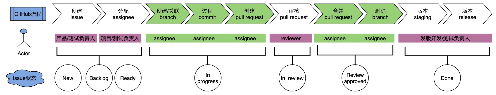

# 贡献于vikadata

非常感谢你抽出宝贵时间来为vikadata做出贡献！
本文档是一份指南，可以帮助你完成为vikadata做出贡献的过程。（当前仅对vika内部，不对外部）

## 行为准则

（后续完善）
## Git Flow 流程

我们采用了国际标准的Git Flow 流程，为加深理解，我们希望所有贡献者在做出贡献前先了解一下[Vika Git Flow故事会](https://vikadata.feishu.cn/docx/doxcn7c0XfzADz7Morbtb5EWXuc)。

## 产研流程

    

为了帮助我们更好地为vikadata贡献一份力，减少不必要的问题出现，我们希望所有贡献者在做出贡献前先了解一下我们当前的[流程指南](docs/contribute/process-guide.md)。

## 如何贡献你的一份力？

你可以通过多种方式为vikadata做出贡献。这里有些例子：

- 提出需求
- 反馈bug
- 开发需求或者修复bug
- 帮助他人审核pull request
- 在issue或者pull request上评论

如需要了解更多贡献方式，请查看[开源指南](https://opensource.guide/how-to-contribute/).

### 提出需求-维格表

当前非产品同学，如果需要提需求，请通过维格表提交：[提产品功能需求](https://integration.vika.ltd/workbench/fomgpsBPFgD1bmSCtY)，经产品同学分析策划并拟定进入迭代后再由其于GitHub vikadata project录入后再同步为issue指派给到开发同学进行开发。

### 反馈bug-维格表

当前非测试同学，如果需要反馈bug，请通过维格表提交：[我要吐个槽](https://integration.vika.ltd/share/shrrLbu30v5ba8g3oySuM/fomYYxH3Nfp5NtVptt)，经测试同学验证为bug后再由其于GitHub vikadata project录入后再同步为issue指派给到开发同学进行修复。

### 录入需求-GitHub
> 不想看文档？可以看视频《产品经理如何在github project上正确录入待办事项》来了解哦：https://vika.cn/workbench/dst58ASUsBxX48q2FD/viwVqV5DcfpKR/recAr8Pzvj16Y

当前主要由产品同学在pbr会议初步确认迭代范围后，于GitHub vikadata project录入，具体如何操作可查看[流程指南](docs/contribute/process-guide.md)。
 
故非产品同学的你，如果有需求要进入迭代处理，请先通过维格表提出需求，如紧急可直接同步至产品同学，由他确认可纳入迭代后再由他进行录入。

### 录入bug-GitHub
> 不想看文档？可以看视频《测试经理如何在github project上正确录入bug》来了解哦：https://vizard.video/s?code=GPH56KEK

当前主要由测试同学验证并且确定是要修复的bug后，于GitHub vikadata project录入，具体如何操作可[流程指南](docs/contribute/process-guide.md)。
 
故非测试同学的你，如果有bug需要修复，请先通过维格表反馈bug，如紧急可直接同步至测试同学，由他确认可纳入迭代后再由他进行录入。（特殊场景：策划或者设计同学在迭代功能测试阶段发现的bug请直接录入GitHub vikadata project。 

### Branches-GitHub

- **创建分支:**
当被指派issue，需要进入迭代处理，请于issue上创建分支，具体如何操作请查看请查看[流程指南](docs/contribute/process-guide.md)。
亦可参考GitHub Docs：[Creating a branch to work on an issue](https://docs.github.com/en/issues/tracking-your-work-with-issues/creating-a-branch-for-an-issue)。

- **删除分支:**
当你的分支已经完成了它的任务，已经合并了，不需在此分支上进行代码编译了，可删除此分支，具体如何操作请查看请查看[流程指南](docs/contribute/process-guide.md)。
亦可参考GitHub Docs： [Deleting a branch](https://docs.github.com/en/pull-requests/collaborating-with-pull-requests/proposing-changes-to-your-work-with-pull-requests/creating-and-deleting-branches-within-your-repository)。

### Pull Requests-GitHub

- **创建pull request:**
当你的分支代码已经编译完成，希望合并至develop或者release分支，请创建pull request，具体如何操作请查看请查看[流程指南](docs/contribute/process-guide.md)。
亦可参考GitHub Docs：[创建pull request](https://docs.github.com/en/pull-requests/collaborating-with-pull-requests/proposing-changes-to-your-work-with-pull-requests/creating-a-pull-request)

- **审核pull request:**
如果你被指派或者需要审核pull request，请进入对应的pull request进行审阅，具体如何操作请查看请查看[流程指南](docs/contribute/process-guide.md)。
亦可参考GitHub Docs：[审核pull request](https://docs.github.com/en/pull-requests/collaborating-with-pull-requests/reviewing-changes-in-pull-requests/reviewing-proposed-changes-in-a-pull-request)。
关于代码审核，建议你可以阅读：[How to do a code review](https://google.github.io/eng-practices/review/reviewer/)以了解有关代码审核的更多信息。

- **合并pull request:**
如果你的pull request已经审核通过，需要合并至develop或者release分支，请使用squash and merge合并，具体如何操作请查看请查看[流程指南](docs/contribute/process-guide.md)。
亦可参考GitHub Docs [合并pull request](https://docs.github.com/en/pull-requests/collaborating-with-pull-requests/incorporating-changes-from-a-pull-request/merging-a-pull-request)

## 风格指南

### Commits

请参考[Conventional Commits](https://www.conventionalcommits.org/en/v1.0.0/)规范每次commit的提交。

（未完待续）
