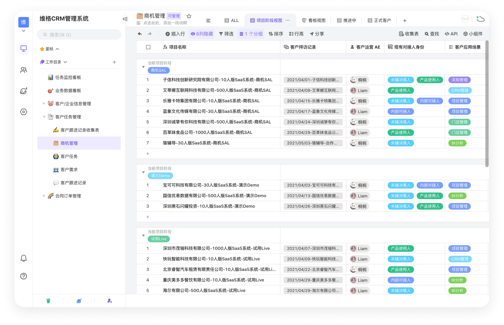

<p align="center">
    
</p>

<p align="center">
    <em>
        vika维格表 & APITable.com | Enterprise版 & SaaS版
    </em>
    <br />
    <a href="https://vikadata.com">vikadata.com</a> & 
    <a href="https://apitable.com">apitable.com</a> 
</p>

<p align="center">
    
</p>


<p align="center">
    <a href="https://vikadata.feishu.cn/wiki/wikcnclZetjWS6OWm9TRXUEwoOg">
      
    </a>
    <a href="https://gitpod.io/#https://github.com/vikadata/vikadata">
        
    </a>
    
    
    
    <a href="#">
        
    </a>
</p>

# Get started

`vikadata` is a cloud-native-based development project.

All commands runs under `containers`.

Setup the environment and run/debug it with Makefile commands.

## 快速开始 Quick Start

vikadata工程基于APITable，基础环境配置，请务必阅读 [APITable Developer Guide](https://github.com/apitable/apitable/blob/develop/docs/contribute/developer-guide.md)

这时候，你已经准备好：
- Docker
- Makefile
- NodeJS
- Java
- Rust


马上快速开始尝试运行vika吧！

```bash
make e # 先进make edition，然后选3, vika-ee; 后进入make env，选1, local-db
make dataenv # 启动docker数据库
make install # 开始安装依赖
make run # 分别多个窗口选1、2、3、4
make build # 本地编译程序
make test # 全量单元测试

# 如需更多更细化的命令，查看Makefile文件
```

`make e` 这个命令， 等于 make env + make edition + make edition-settings

`make edition`提供了多个发行版（EDITION）的切换，可选发行版: 
> 1. apitable-ce（默认）: APITable默认开源版
> 2. apitable-ee: APITable企业SaaS版
> 3. vika-ee: vika维格表企业SaaS版
建议一般执行`3`。

`make env`，详情看下文5种开发环境搭建模式，上面使用了local模式；

`make edition-settings`，用于不同版本的settings配置、logo更换等；
`make install`，是安装依赖包；

## 如果你是研发 Are you developer?

我们提供5种开发环境搭建的模式：

1. **docker-all**: docker执行所有local代码的服务 + docker启动本机数据库(dataenv)，开源版只保留这种模式，兼容make up命令；
2. **local-db**: 只启动docker数据库环境，不启动任何应用服务，方便你用vscode或intellij idea开发；
3. **remote-db**: 将development系列数据库流量引本地，方便你用vscode或intellij idea开发；
4. **integration**: 将integration的服务和流量牵引到本地，本地debug的程序会默认连接上integration环境；
5. **testing**: 将testing的服务和流量牵引到本地，本地debug的程序会默认连接上testing环境；

请查看：[⭐️ 5种开发环境的使用指南](./docs/devenv/devenv.md)，手把手教你搭建5种不同的开发环境。

## 如果你是产品或测试 Are you QA or PD?

如果你是产品，仅仅想在本地运行整个vika维格表，在你本地电脑上运行所有的服务(production environment, 无编译, 直接使用生产容器)：

```bash
# 从网上下载所有生产容器，需要提前准备好下载秘钥哦
CR_PAT=$CR_PAT_GITHUB_TOKEN make pull

# 根据你的机器是arm64或amd64进行启动
make up

# 如果你是macOS M1 ARM芯片，想强制x86架构运行
make up-amd64

# 相反，x86的Docker，也支持ARM的运行
make up-arm64
```

就这么简单，这时候访问 [https://localhost:80](https://localhost:80) ，就能访问vika维格表啦

哦，你平日肯定经常需要制作模板(init-template)和配置文件(init-settings)对吧。

```bash
# 仅支持vikadata工程
make settings
make templates
```

## 你是TDD大神？试试云原生开发环境 Full-stack Local Development Environment

如果你是研发，要搭建本地开发(development environment)，你非常TDD（测试驱动），你根本不需要debug和IDE
那么，你可以纯粹使用云原生开发形式，在你本地电脑上以容器作为运行时，调试和运行本地代码：

```bash
# 安装依赖
make install

# start up data services and dev environment
make dataenv
make devenv

# follow devenv all console logs
make devenv-logs

# view devenv services
make devenv-ps
# view all services
make ps

# shutdown all
make devenv-down
make dataenv-down
```

这时候，会启动数据服务（mysql+mongodb+redis+....)，并运行本地代码。
是的，很吃内存，所以很多时候没必要全部运行，如果你只想运行某一个服务：

```bash
# 只运行一个服务...
make install-socket-server
make devenv-socket-server
```

> 云原生容器之下运行，也支持Intellij IDEA和Visual Studio Code的断点调试，详情看: [Intellij IDEA & Visual Studio Code](./docs/devenv/why.md)

## 如果你想模拟CI运行？


如果你想模拟CI自动化，一次性在你本地电脑上编译所有的容器并推送镜像服务器：

```
CR_PAT=$CR_PAT_GITHUB_TOKEN make pull
make buildpush
```


更多功能，请:
```bash
make 
```

更多查看：[为什么要用云原生的方式搭建开发环境？](./docs/devenv/why.md)

## 如果你负责发版(tag/release)

请确保版本提升，并生成changelog
```bash
make bumpversion
# 选择修改哪个版本号，会批量改

make changelog
# 生成CHANGELOG.md，手工修改最终结果，完成后打tag
```

## 代码或配置生成器(make gen)

你可以使用以下命令生成代码、配置文件、设计资料等：
```bash
make gen
```

这些配置，通常都是使用vika API，读取维格表中的配置并进行生成的，会弹出5个选项：

1) settings-ce:
2) settings-SaaS
3) proto: 
4) design: 
5) edition-settings: 
    a. apitable
    b. vika
    c. ....
6) templates-pack: 

## 周边工具 Tools

在开发过程中，我们将不断抽离一些组件，作为独立的开发工具（或开源），以下整理一些：
- [apphook](https://github.com/apitable/apphook): EventManager事件引擎
- [github-changelog-builder](https://github.com/apitable/github-changelog-builder): CHANGELOG生成器
- [apitable-settings-generator](https://github.com/apitable/apitable-settings-generator): 配置生成器
- [apitable-i18-generator](https://github.com/apitable/apitable-i18n-generator): 多语言配置生成与加载库

# Documentation

Vikadata is a Commercial version of Open Source [APITable](https://github.com/apitable/apitable) which added full enterprise-ready features:

- 社交登录 Social Login, 微信/飞书/企业微信/钉钉/Slack/GMail....
- 文档附件等插件
- SAML/OAuth 账号鉴权
- 审计 Audit
- SSO 单点登录
- Advanced Embedding 高级嵌入
- APITable.com / vikadata.com SaaS环境开发融合


You can read the **Dev Handbook** from our wiki.

- [](https://vikadata.feishu.cn/wiki/wikcnclZetjWS6OWm9TRXUEwoOg)

Also read our public Developers Center website:
- [开发者中心](https://developers.vika.cn)

And you can read [`Contributing`](#contributing) chapter for more general development docs.

# Contributing

## APITable项目关系
`vikadata` is a `APITable`-based project:

| DISTRO 发行版 |  EDITION 版本类型          | VERSION 版本号            |
| --           |  --                       |           --             |
| APITable     | Community,SaaS,Enterprise | vX.Y.Z-alpha+apitable... |
| Vika         | SaaS, Enterprise          | vX.Y.Z-alpha+vika...     |


Please read [APITable Contributing Guide](https://github.com/apitable/apitable/blob/develop/CONTRIBUTING.md) first.

## APITable项目的交互

`apitable/`目录，是使用git subtree命令，对开源项目[APITable](https://github.com/apitable/apitable)

首次获得vikadata工程，你可以执行`make apitable (选3)`，为你的本地仓库实现subtree init。

通常情况，开源功能在APITable项目开发、企业版功能在vikadata开发，

`make apitable (选1)`，进行subtree pull，会将APITable的`develop`分支，更新到vikadata的`apitable/` subtree；
`make apitable (选2)`，进行subtree push，会将将vikadata的`apitable/` subtree，推送到APITable的`develop-enterprise`分支；

## Structure

Vikadata project file structures:
```bash
.
├── apitable # Open Source Project APITable, which will be split to a independent repo later.
│  ├── init-db # init container that init databases schema 
│  ├── backend-server # Java Spring Boot based `backend-server` container
│  └── packages # nodejs packages
│      ├── datasheet # `web-server` container
│      ├── room-server # `room-server` container
│      └── socket-server # `socket-server` container
├── CHANGELOG.md # version update information, releases changelogs
├── SECURITY.md # Security Policy and reporting vulnerability
├── LICENSE.md # Open source license, commercial license, embedding license, enterprise license, Cloud(SaaS) 
├── docs # Documentation and static resources files.
```

More contributing details:

- [make命令列表和区别](./docs/makefile/makefile.md)
- [Gitpod一键云端开发环境](./docs/gitpod.md)
- [查看产品需求表 Product Backlogs](#)
- [查看研发任务表 Vikadata Issues](https://github.com/vikadata/vikadata/issues)
- [前端&NodeJS开发注意事项](./docs/frontend.md)
- [业务配置表&多语言翻译](./docs/settings.md)
- [Sentry&Bug监控](./docs/sentry.md)
- [私有化(self-hosted)注意事项(过时)](./docs/self-hosted.md)
- [APITable Git版本管理指南](./docs/apitable-git.md)
- [如何创建一个AutomationAction](./docs/action/en-US/how-to-create-automation-action.md)

# Get involved

- [Vikadata Github Home](https://github.com/vikadata)
- [APITable Github Home](https://github.com/apitable)
- [维格公司首页](https://about.vika.cn)
- [vika维格表](https://vika.cn)
- [APITable.com](https://apitable.com)

## Debug Tool

- Sentry: https://apitable.getoutline.com/doc/2023click-me-wiuLHMyILr#h-sentry
- LangSmith: https://smith.langchain.com/
- K8s: https://apitable.getoutline.com/doc/2023click-me-wiuLHMyILr#h-k8s
- ELK: https://apitable.getoutline.com/doc/2023click-me-wiuLHMyILr#h-kibana
- 1Password: https://apitable.getoutline.com/doc/2023click-me-wiuLHMyILr#h-1pasword
- Vika-auth: https://apitable.getoutline.com/doc/2023click-me-wiuLHMyILr#h-vika-auth
- Github: https://apitable.getoutline.com/doc/2023click-me-wiuLHMyILr#h-github-1
- APIDocs: https://apitable.getoutline.com/doc/2023click-me-wiuLHMyILr#h-api-docs
# License

Vikadata is under Commercial License. See: [LICENSE.md](./LICENSE.md)

Copyright &copy; 2022 **Vika, inc. (Hong Kong)** and **APITable PTE.LTD. (Singapore)**
