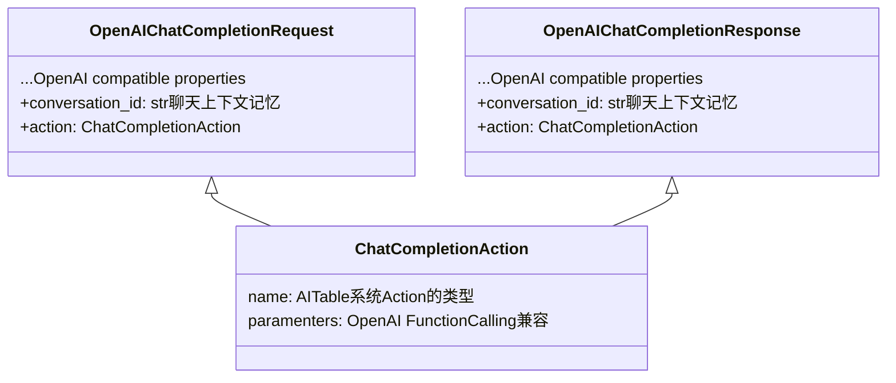
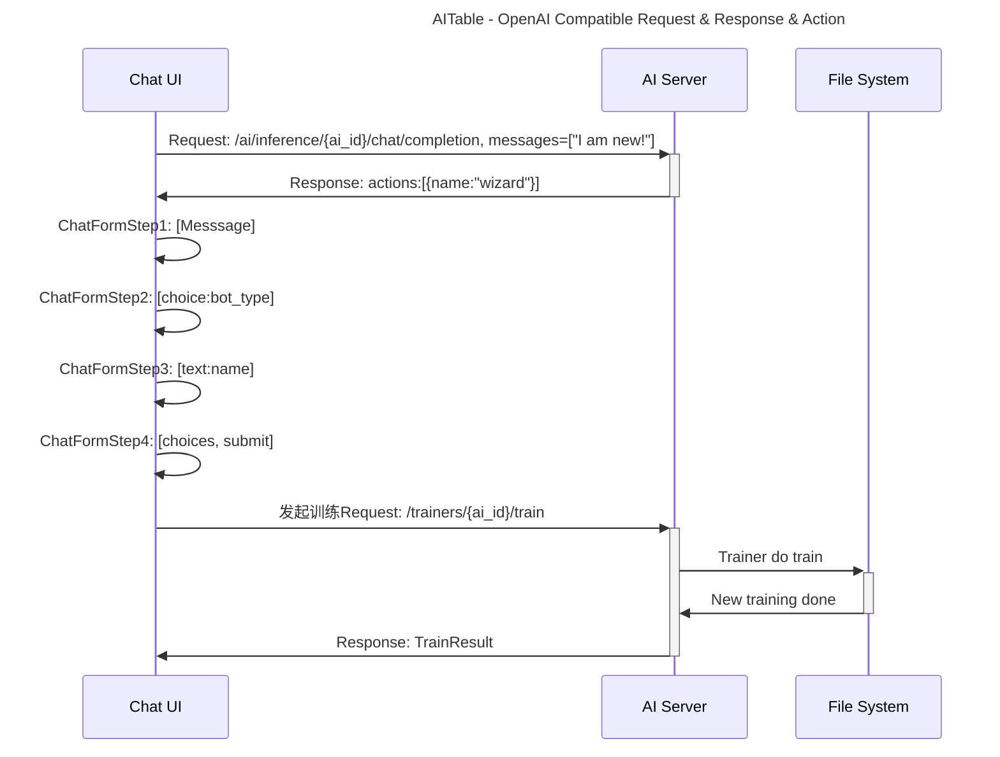
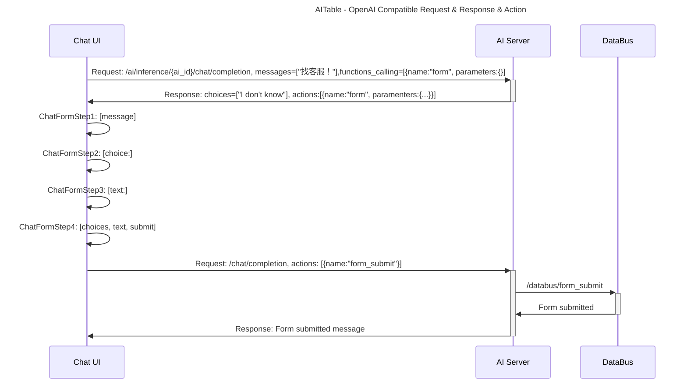
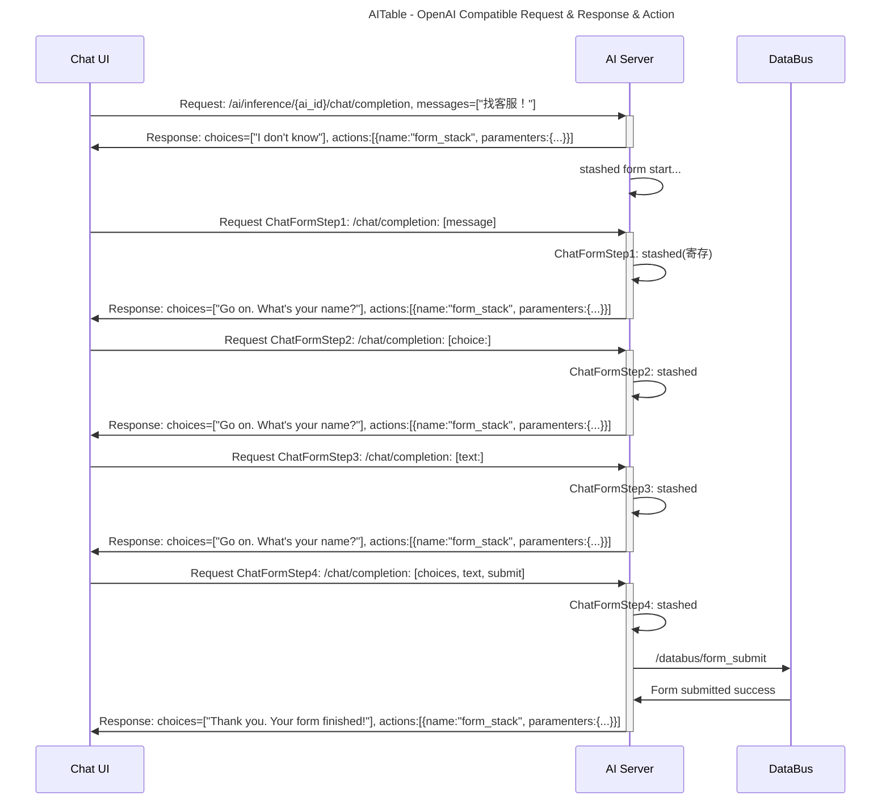

## AITable Chat Action系统 & AI Form表单实现
> [Back](../README.md)

### 这是什么？
AIServer的Chat Completion API是完整兼容OpenAI的API接口。
在OpenAI接口的基础上，我们加入少量额外属性进行增强：

其中Action系统，是用于AITable/Vika自有AI系统中的行为驱动器，它的参数，又同样兼容了OpenAI的Function Calling接口。

与Function Calling的区别是，OpenAI的Function Calling是传递AI LLM自然语言识别的；
而AITable/Vika的这个Action参数，则是直接处理和执行，无需经过LLM大语言模型。

### 场景类比

以人类的三种交流形态举例子：

1. 闲聊：Hi, 今天天气不错哦？ 是呀，好好啊。 (Default Chat)
2. 咨询：我不开心，你能让我开心吗？  好呀，你说说看。 ...建议你....(Function)
3. 要求： 你帮我那支笔过来。  OK，这是你的笔 (Action)

OpenAI概念：
- Function: 客户端要求AI的行为
- Agent: 服务端自动识别AI的行为

我们的Action概念：
- ClientRequestAction: 客户端要求必须执行的行为
- ServerRequestAction: 服务端要求必须执行的行为

#### 场景1：聊天过程中，出收集表单：
1. 客户端正在AI聊天，带上Function：RequestClientShowFormFunction
2. 服务单跟AI沟通，命中了这个Function，然后，告诉客户端，请你执行FormAction, parameters: XXXX
3. 客户端收到服务端的FormAction通知，执行FormAction.call(parameters)

#### ✅ 场景2：聊天过程中，出收集表单： 
1. 客户端正在AI聊天
2. 服务端Agent判断，命中了这个Action，然后，告诉客户端，请你执行FormAction, parameters: form_object
3. 客户端收到服务端的FormAction通知，执行FormAction.call(parameters)

#### 场景3：咨询机票价格
1. 客户端跟AI聊天，不带function，但是，服务端有agent
2. 服务端Agent判断，要查询一些携程的价格，然后返回聊天结果；

> 以下以一个新的AI创建后，尚未被训练(Training)，AI如何通过/chat/completion接口，进行Wizard新手引导做初始化训练。

### 1. Client-side Form: 新AI的初始化训练 New AI's training wizard

场景，新建AI后，尚未进行训练。

(与Dual-side Form Action略有不同，Wizard过程，前端直接呼叫Train接口，而不是继续/chat/completion)

### 2. Dual-side Form模式：客户聊天过程的收集聊天线索 Sales Leads Collecting Form

场景，客服聊天过程中出现线索表单。

### 3. Server-side Form模式：第三方平台聊天过程的表单处理 3rd Integrations Form
这是最复杂的形态，场景为，当客户端为第三方聊天集成，客户端没有action自定义能力，因此所有Form能力，需要服务端承载。

这里借用Git的两个概念：Stash和Stack，即Git Stash功能，详情自行Google了解。

服务端判断要进行form后，自行启动FormStack模式，每次客户端的聊天，服务端都被视其为一次stash，满足FormStack所有条件后，才视为一次FormSubmit Action。

