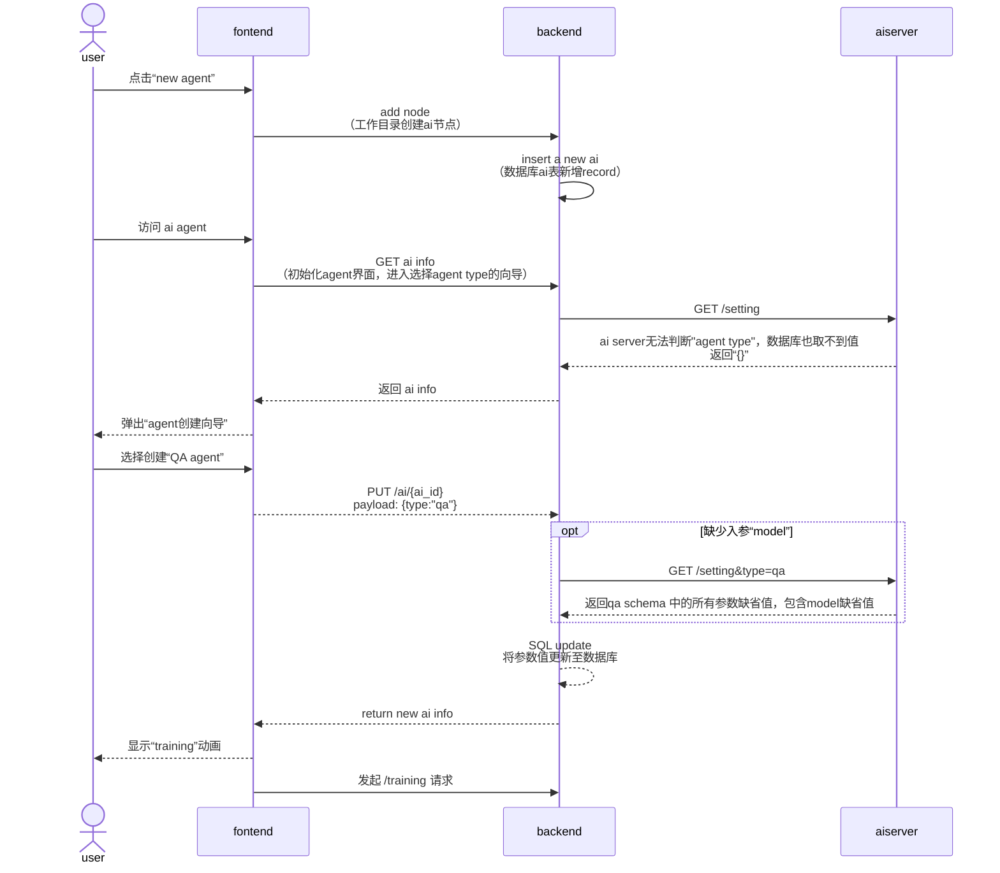
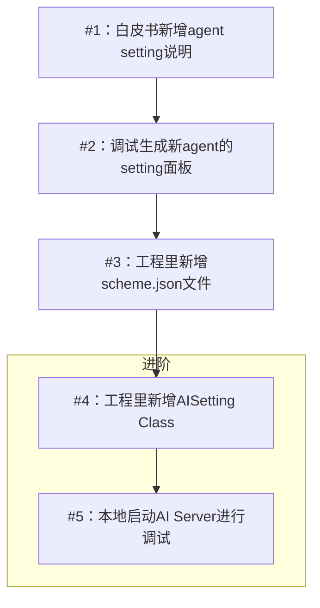

# AI Settings Schema Guide

JSON Schema 是一种用于描述 JSON 数据结构的规范。它是一种基于 JSON 格式的元数据规范，用于定义 JSON 数据的结构、格式和约束。JSON Schema 可以用来验证、文档化和协助理解 JSON 数据，以及确保 JSON 数据符合特定的规则和标准。
  
主要用途有：数据验证，数据文档化，数据交换，自动生成代码，API 设计等等。详情介绍请看文末附录#1。

而 AITable 的 AI Agent 和 Automation 功能都使用了 JSON Schema 来进行数据验证和自动生成代码（下文有具体示例）。


## setting 的数据通讯时序图




##   一、为何选用 JSON Schema 来定义 AI Agent 的设置项？

- **丰富的工具支持**
    JSON Schema拥有丰富的工具生态系统。结合 react-jsonschema-form，我们能快速生成前端表单界面，同时在各种编程语言中都有相应的依赖库，可立即使用。schema写完，约等于前端的“设置面板”开发完毕，约等于前端、后端、AI服务端完成了数据验证的逻辑代码。

- **逻辑性强**
    在复杂场景下，常规的PRD文档难以清晰传达业务逻辑。JSON Schema具有强大的逻辑性，能够简化验证逻辑并减少代码复杂度，节省团队的时间。
    以QA Agent、Chat Agent和即将推出的Data Agent、Creator Agent等为例，每种Agent的设置项都不同。采用传统方法，产品策划需要编写大量弱逻辑文档，从而增加沟通成本和反复验证的开销。 JSON Schema可有效解决这一问题。


## 二、如何使用 JSON Schema 创建 AI Agent 设置项？

在本章中，我们将以一个实际场景作为例子，假设您是产品策划，接到了一个需求：在您的AI Table中新增一种专门用于生成小红书爆文的AI Creator Agent。
我们将逐步讲解如何创建该Creator Agent的JSON Schema，并介绍如何进行调试和提交到项目的步骤。这将帮助您了解如何使用JSON Schema在您的项目中定义和管理AI Agent的设置项。

大致分成下面几个步骤



### 1. 白皮书新增 Agent Setting 说明

 首先，你需要打开 [《Agent 矩阵 AISetting白皮书》](https://vikadata.feishu.cn/docx/Lt9Ode17io4yatxmqdEcdZaMnlf)， 仿照其他Agent的格式，追加补充 Creator Agent 的相关信息，例如用户故事、场景、Prompt、Data Structure 等等。
 补充完毕后，发起产品方案评审。过审后进行下一步。


### 2. 调试并生成新 Agent 的 setting schema 面板

有了第一步的基础信息，你已经搞懂了 Creator Agent 的场景以及具备哪些设置项了。第二步就是遵循JSON Schema的语法规则，详细定义Agent所需的各种属性、数据类型以及验证规则。

react-jsonschema-form 提供了一个在线的 Playground，里面包含了所有支持的form组件的examples。

请你打开 Playground，根据第1步的白皮书，为不同数据类型（string, number, boolean...）的 Agent 设置项选择合适的 form 组件，拼凑出完整的“AI Agent 设置面板”。

Playground 地址：[点我跳转](https://rjsf-team.github.io/react-jsonschema-form/)
附一个 QA Agent 的示例供参考：[点我跳转](https://rjsf-team.github.io/react-jsonschema-form/#eyJmb3JtRGF0YSI6eyJtb2RlIjoid2l6YXJkIiwiYm90TW9kZWwiOiJncHQtMy41LXR1cmJvIiwicHJvbG9ndWUiOiJIaSB0aGVyZSwgSSdtIGFuIEFJIGNoYXRib3QuIE5pY2UgdG8gbWVldCB5b3UhIFdpdGggbXkgdHJhaW5pbmcgb24gdmFyaW91cyBkYXRhc2V0cywgSSdtIGNhcGFibGUgb2YgYW5zd2VyaW5nIHlvdXIgcXVlc3Rpb25zLiIsImlzRW5hYmxlZFByb21wdEJveCI6dHJ1ZSwiaXNFbmFibGVkUHJvbXB0VGlwcyI6dHJ1ZSwicHJvbXB0IjoiVGhlIGZvbGxvd2luZyBpcyBhIGNvbnZlcnNhdGlvbiBiZXR3ZWVuIGEgaHVtYW4gYW5kIGFuIEFJLiBcblxuQ3VycmVudCBjb252ZXJzYXRpb246XG5cbntoaXN0b3J5fVxuXG5IdW1hbjoge2lucHV0fVxuXG5BSToiLCJ0ZW1wZXJhdHVyZSI6MC43LCJzY29yZVRocmVzaG9sZCI6MC44MDAxLCJzY29yZVRocmVzaG9sZFdpemFyZCI6MC44MDAxfSwic2NoZW1hIjp7IiRzY2hlbWEiOiJodHRwOi8vanNvbi1zY2hlbWEub3JnL2RyYWZ0LTA3L3NjaGVtYSMiLCJ0aXRsZSI6IlFBIEFnZW50IFNldHRpbmcgSlNPTiBTY2hlbWEiLCJ0eXBlIjoib2JqZWN0IiwicHJvcGVydGllcyI6eyJtb2RlIjp7InRpdGxlIjoiQWdlbnQgTW9kZSIsImRlc2NyaXB0aW9uIjoiQWR2YW5jZWQgbW9kZSBhbGxvd3MgdXNlcnMgdG8gY3VzdG9taXplIHByb21wdHMsIHByb3ZpZGluZyBncmVhdGVyIGNvbnRyb2wgb3ZlciB0aGUgYmVoYXZpb3IgYW5kIHJlc3BvbnNlcyBvZiB0aGUgY2hhdGJvdC4iLCJ0eXBlIjoic3RyaW5nIiwiZGVmYXVsdCI6IndpemFyZCIsIm9uZU9mIjpbeyJ0eXBlIjoic3RyaW5nIiwidGl0bGUiOiJXaXphcmQiLCJlbnVtIjpbIndpemFyZCJdfSx7InR5cGUiOiJzdHJpbmciLCJ0aXRsZSI6IkFkdmFuY2VkIiwiZW51bSI6WyJhZHZhbmNlZCJdfV19LCJib3RNb2RlbCI6eyJ0aXRsZSI6IkFJIG1vZGVsIiwidHlwZSI6InN0cmluZyIsImVudW0iOlsiZ3B0LTMuNS10dXJibyIsImdwdC0zLjUtdHVyYm8tMDYxMyIsImdwdC0zLjUtdHVyYm8tMTZrIiwiZ3B0LTMuNS10dXJiby0xNmstMDYxMyIsImdwdC00IiwiZ3B0LTQtMDYxMyJdLCJkZWZhdWx0IjoiZ3B0LTMuNS10dXJibyJ9LCJwcm9sb2d1ZSI6eyJ0aXRsZSI6Ik9wZW5pbmcgcmVtYXJrcyIsImRlZmF1bHQiOiJIaSB0aGVyZSwgSSdtIGFuIEFJIGNoYXRib3QuIE5pY2UgdG8gbWVldCB5b3UhIFdpdGggbXkgdHJhaW5pbmcgb24gdmFyaW91cyBkYXRhc2V0cywgSSdtIGNhcGFibGUgb2YgYW5zd2VyaW5nIHlvdXIgcXVlc3Rpb25zLiIsInR5cGUiOiJzdHJpbmcifSwiaXNFbmFibGVkUHJvbXB0Qm94Ijp7InRpdGxlIjoiU2hvdyBleHBsb3JlIGNhcmQiLCJkZWZhdWx0Ijp0cnVlLCIkcmVmIjoiIy9kZWZpbml0aW9ucy9jaGVja2JveCJ9LCJpc0VuYWJsZWRQcm9tcHRUaXBzIjp7InRpdGxlIjoiU2hvdyBzdWdnZXN0aW9ucyBmb3IgZm9sbG93LXVwIG1lc3NhZ2VzIiwiZGVmYXVsdCI6dHJ1ZSwiJHJlZiI6IiMvZGVmaW5pdGlvbnMvY2hlY2tib3gifSwib3BlblVybElmSURLIjp7InRpdGxlIjoiT3BlbiBzcGVjaWZpZWQgdXJsIHdoZW4gYWdlbnQgZG9uJ3Qga25vdyB0aGUgYW5zd2VyIiwiJHJlZiI6IiMvZGVmaW5pdGlvbnMvY2hlY2tib3gifSwiaXNFbmFibGVDb2xsZWN0SW5mb3JtYXRpb24iOnsidGl0bGUiOiJVc2luZyBmb3JtIHRvIGNvbGxlY3QgaW5mb3JtYXRpb24iLCIkcmVmIjoiIy9kZWZpbml0aW9ucy9jaGVja2JveCJ9fSwicmVxdWlyZWQiOltdLCJkZXBlbmRlbmNpZXMiOnsib3BlblVybElmSURLIjp7Im9uZU9mIjpbeyJwcm9wZXJ0aWVzIjp7Im9wZW5VcmxJZklESyI6eyJlbnVtIjpbdHJ1ZV19LCJvcGVuVXJsIjp7InRpdGxlIjoiVXJsIiwidHlwZSI6InN0cmluZyJ9LCJvcGVuVXJsVGl0bGUiOnsidGl0bGUiOiJVcmwgdGl0bGUiLCJ0eXBlIjoic3RyaW5nIn19LCJyZXF1aXJlZCI6WyJvcGVuVXJsIiwib3BlblVybFRpdGxlIl19XX0sImlzRW5hYmxlQ29sbGVjdEluZm9ybWF0aW9uIjp7Im9uZU9mIjpbeyJwcm9wZXJ0aWVzIjp7ImlzRW5hYmxlQ29sbGVjdEluZm9ybWF0aW9uIjp7ImVudW0iOlt0cnVlXX0sImZvcm1JZCI6eyJ0aXRsZSI6IkZvcm0gSWQiLCJ0eXBlIjoic3RyaW5nIn19LCJyZXF1aXJlZCI6WyJmb3JtSWQiXX1dfX0sImRlZmluaXRpb25zIjp7ImNoZWNrYm94Ijp7InR5cGUiOiJib29sZWFuIn19LCJhbGxPZiI6W3siaWYiOnsicHJvcGVydGllcyI6eyJtb2RlIjp7ImNvbnN0IjoiYWR2YW5jZWQifX19LCJ0aGVuIjp7InByb3BlcnRpZXMiOnsicHJvbXB0Ijp7InRpdGxlIjoiUHJvbXB0IiwiZGVmYXVsdCI6IlRoZSBmb2xsb3dpbmcgaXMgYSBjb252ZXJzYXRpb24gYmV0d2VlbiBhIGh1bWFuIGFuZCBhbiBBSS4gXG5cbkN1cnJlbnQgY29udmVyc2F0aW9uOlxuXG57aGlzdG9yeX1cblxuSHVtYW46IHtpbnB1dH1cblxuQUk6IiwidHlwZSI6InN0cmluZyJ9LCJ0ZW1wZXJhdHVyZSI6eyJ0aXRsZSI6IlRlbXBlcmF0dXJlIiwiZGVzY3JpcHRpb24iOiJUaGUgaGlnaGVyIHRoZSB0ZW1wZXJhdHVyZSwgdGhlIG1vcmUgY3JlYXRpdmUgdGhlIGNoYXRib3Qgd2lsbCBiZS4gVGhlIGxvd2VyIHRoZSB0ZW1wZXJhdHVyZSwgdGhlIG1vcmUgcHJlZGljdGFibGUgdGhlIGNoYXRib3Qgd2lsbCBiZS4iLCJkZWZhdWx0IjowLjcsInR5cGUiOiJudW1iZXIiLCJtaW5pbXVtIjowLCJtYXhpbXVtIjoxLCJtdWx0aXBsZU9mIjowLjAxfSwic2NvcmVUaHJlc2hvbGQiOnsidGl0bGUiOiJTaW1pbGFyaXR5IEZpbHRlciIsImRlc2NyaXB0aW9uIjoiVGhlIHJlbGV2YW5jZSBsZXZlbCBvZiB0aGUgY2hhdGJvdCB3aGVuIHJldHJpZXZpbmcgcmVsYXRlZCBrbm93bGVkZ2UuIExvd2VyIHRocmVzaG9sZHMgbWF5IHJlc3VsdCBpbiBpcnJlbGV2YW50IGluZm9ybWF0aW9uLCB3aGlsZSBoaWdoZXIgdGhyZXNob2xkcyBtYXkgbWlzcyB1c2VmdWwgaW5mb3JtYXRpb24uIiwiZGVmYXVsdCI6MC44MDAxLCJ0eXBlIjoibnVtYmVyIiwibWluaW11bSI6MCwibWF4aW11bSI6MSwibXVsdGlwbGVPZiI6MC4wMDAxfX19fSx7ImlmIjp7InByb3BlcnRpZXMiOnsibW9kZSI6eyJjb25zdCI6IndpemFyZCJ9fX0sInRoZW4iOnsicHJvcGVydGllcyI6eyJzY29yZVRocmVzaG9sZFdpemFyZCI6eyJ0aXRsZSI6IlNpbWlsYXJpdHkgRmlsdGVyIiwiZGVzY3JpcHRpb24iOiJUaGUgcmVsZXZhbmNlIGxldmVsIG9mIHRoZSBjaGF0Ym90IHdoZW4gcmV0cmlldmluZyByZWxhdGVkIGtub3dsZWRnZS4gTG93ZXIgdGhyZXNob2xkcyBtYXkgcmVzdWx0IGluIGlycmVsZXZhbnQgaW5mb3JtYXRpb24sIHdoaWxlIGhpZ2hlciB0aHJlc2hvbGRzIG1heSBtaXNzIHVzZWZ1bCBpbmZvcm1hdGlvbi4iLCJkZWZhdWx0IjowLjgwMDEsInR5cGUiOiJudW1iZXIiLCJhbnlPZiI6W3sidHlwZSI6Im51bWJlciIsInRpdGxlIjoiUmVsYXhlZCIsImVudW0iOlswLjAwMDFdfSx7InR5cGUiOiJudW1iZXIiLCJ0aXRsZSI6Ik1vZGVyYXRlIiwiZW51bSI6WzAuNjAwMV19LHsidHlwZSI6Im51bWJlciIsInRpdGxlIjoiU3RyaWN0IiwiZW51bSI6WzAuODAwMV19XX19fX1dfSwidWlTY2hlbWEiOnsicHJvbG9ndWUiOnsidWk6d2lkZ2V0IjoidGV4dGFyZWEiLCJ1aTpkZXNjcmlwdGlvbiI6IlRoZSBjb250ZW50IHRoYXQgdGhlIGNoYXRib3Qgd2lsbCBzYXkgd2hlbiBhIG1lbWJlciBjaGF0cyB3aXRoIGl0IGZvciB0aGUgZmlyc3QgdGltZS4iLCJ1aTpvcHRpb25zIjp7InJvd3MiOjh9fSwicHJvbXB0Ijp7InVpOndpZGdldCI6InRleHRhcmVhIiwidWk6ZGVzY3JpcHRpb24iOiJUaGUgc3RhcnRpbmcgdGV4dCBvciBtZXNzYWdlIHRoYXQgYSB1c2VyIHByb3ZpZGVzIHRvIGluaXRpYXRlIGEgY29udmVyc2F0aW9uIHdpdGggdGhlIGxhbmd1YWdlIG1vZGVsLiBJdCBjYW4gYmUgdGhvdWdodCBvZiBhcyBhIHByb21wdCBvciBhIGN1ZSBmb3IgTExNIHRvIGdlbmVyYXRlIGEgcmVzcG9uc2UuIiwidWk6b3B0aW9ucyI6eyJyb3dzIjo4fX0sInRlbXBlcmF0dXJlIjp7InVpOndpZGdldCI6InJhbmdlIn0sInNjb3JlVGhyZXNob2xkIjp7InVpOndpZGdldCI6InJhbmdlIn0sInVpOm9yZGVyIjpbIioiLCJwcm9sb2d1ZSIsInByb21wdCIsInRlbXBlcmF0dXJlIiwic2NvcmVUaHJlc2hvbGQiLCJzY29yZVRocmVzaG9sZFdpemFyZCIsImlzRW5hYmxlZFByb21wdEJveCIsImlzRW5hYmxlZFByb21wdFRpcHMiLCJvcGVuVXJsSWZJREsiLCJvcGVuVXJsIiwib3BlblVybFRpdGxlIiwib3BlbkZvcm1JZklESyIsImlzRW5hYmxlQ29sbGVjdEluZm9ybWF0aW9uIiwiZm9ybUlkIl19LCJ0aGVtZSI6ImRlZmF1bHQiLCJsaXZlU2V0dGluZ3MiOnsic2hvd0Vycm9yTGlzdCI6InRvcCIsInZhbGlkYXRlIjpmYWxzZSwiZGlzYWJsZWQiOmZhbHNlLCJub0h0bWw1VmFsaWRhdGUiOmZhbHNlLCJyZWFkb25seSI6ZmFsc2UsIm9taXRFeHRyYURhdGEiOmZhbHNlLCJsaXZlT21pdCI6ZmFsc2UsImV4cGVyaW1lbnRhbF9kZWZhdWx0Rm9ybVN0YXRlQmVoYXZpb3IiOnsiYXJyYXlNaW5JdGVtcyI6InBvcHVsYXRlIiwiZW1wdHlPYmplY3RGaWVsZHMiOiJwb3B1bGF0ZUFsbERlZmF1bHRzIn19fQ==)

> - 如果你不懂 react-jsonschema-form 如何使用，请看官方文档：[点我跳转](https://rjsf-team.github.io/react-jsonschema-form/docs/)
> - 如果你不懂 JSON Schema 语法（默认使用版本 draft-07 ） ，请看官方文档：[点我跳转](https://json-schema.org/draft-07/json-schema-release-notes)

Playground 的好处在于可见即可得，调试与效果实时对照。当你把 setting 面板拼凑完毕后，进入下一步。

### 3. 在代码工程中创建 Agent 的 schema 文件

所有 agents 的 schemas 文件都存放在 `vikadata/ai/ai_shared/ai_setting/schemas`  文件夹里。
每一个schema文件都描述了一种 AI Agent 设置项的各种属性、数据类型以及验证规则。

当用户在 AI Agent 的聊天界面点击“setting”按钮的时候，前端就会向服务器拉取 schema file 的内容，然后根据 schema 动态渲染成 “设置面板”。

你需要在该文件夹下新建一个名为 `creator_ai_schema.json` 的文件，然后将第2步里生成的 `JSONSchema` 和 `UIScehma`  JSON内容复制粘贴到该文件里。

schema file 的数据结构如下：

```json
{
    "JSONSchema": {
        // Agent的设置项，验证规则放这里
    },
    "UISchema": {
        // 在这里定义前端的 UI 组件样式
    }
}
```


最后一步就是 `git commit`，将新的 agent scheme 文件提交到个人分支上，然后合并到develop 分支。至此，作为产品策划你的任务就结束了。


### 进阶步骤

如果你是一名负责 AI Server 的研发同事，或者懂代码开发的产品策划，那你可以接着往下看了。

每新增一种 AI Agent，你需要在 `vikadata/ai/ai_shared/ai_setting/` 新增一个 AISetting 类文件。

新增 Creator Agent ，则需要新创建 `creator_ai_setting.py` 文件。

然后请仿照其它已有的 AISetting 类文件的代码，完善 `creator_ai_setting.py` 

接着，你可以在本地开发环境启动 AI Server，浏览器访问 `http://127.0.0.1:8626/ai/doc`，进行 setting 接口的在线调试。


## 如何进行调试

（TBC）

## 如何进行数据验证

（TBC）

## 如何编写单元测试

（TBC）

### Q & A

**Q：当我在设计新Agent的设置项时，发现有一些逻辑无法使用现有的react-json-schema UI widget，该怎么办？

只能让设计师重新设计新的UI组件，然后让研发基于 react-json-schema 的规范，定制化开发新的UI Widget


**Q：前端使用 react-json-schema 来渲染表单交互组件，对于设计有哪些影响？**

虽然 react-json-schema 支持 theme 变更（AntDesign，material-UI等等），但仍需要自行实现 dark 和 light 模式；
当业务复杂时，需要定制化新的UI widget；
部分数据类型的字段只能使用依赖库现有的UI widget, 一定程度上限制了设计师的发挥空间。
  
  
  

## 附录

1. [json-schema.org](https://json-schema.org/)
2. [react-jsonschema-form](https://rjsf-team.github.io/react-jsonschema-form/docs/)
3. [react-jsonschema-form playground](https://rjsf-team.github.io/react-jsonschema-form/)