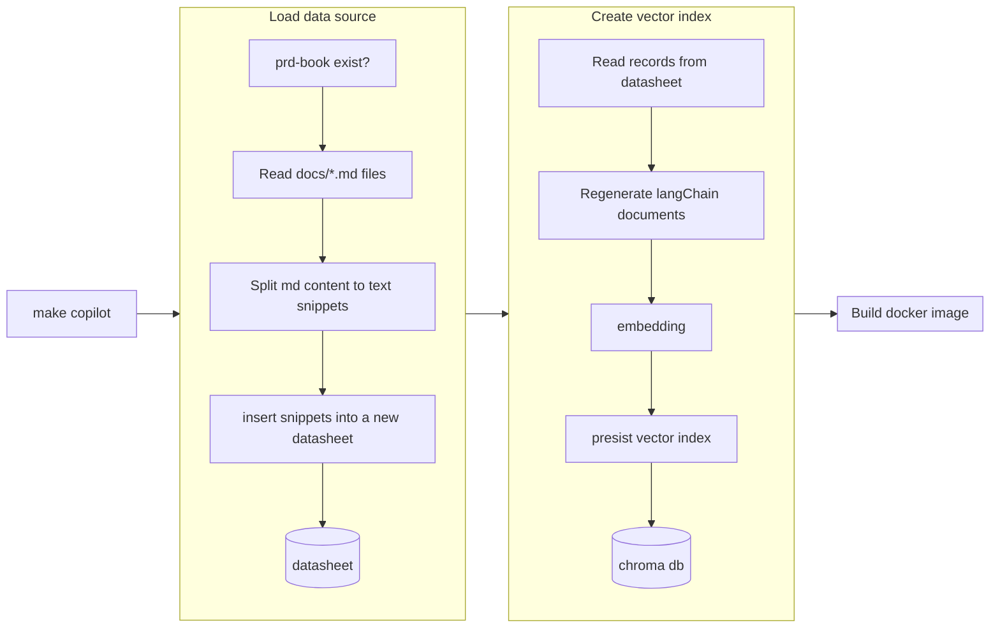

# Copilot 开发指南


CopilotAgent = DataPilotTool + HelpCenterTool

## 本地开发



### 第一步：配置环境变量

在 `/ai/` 文件夹下的 `.env` 填写环境变量

```
// 注意：必须是可以访问公司空间站的帐号的token，用于将帮助中心的文档切片后通过 FusionAPI 上传至公司的空间站
VIKA_API_USER_TOKEN={你的维格表个人 token}
AITABLE_API_USER_TOKEN={你的 aitable 个人 token}

// 需要与上方的 token 搭配使用
EDITION=apitable-saas // or "vika-saas"
```

### 第二步：加载数据源（可选）

将文档工程里的 md 文档进行切片，然后上传至维格表/AITable 备用。

> 这步骤是可选的，不是必须执行。如果有其他同事已经提前完成此步骤，则你本地开发时无需执行此步骤。切片后的文档片段请看：
> 
> [维格表的文档片段](https://vika.cn/workbench/dsth6BkiWbmBkdyZbD/viwYzcR7SBXAh)
> 
> [AITable的文档片段](https://aitable.ai/workbench/dstkPkLnY9rbpdPruG/viw1AdoNrRKXL)


下面将开始介绍如何切片和上传。首先，你需要提前在本地 git clone 两个帮助中心网站的代码工程到本地

```bash
# Vika的帮助中心
git clone git@github.com:vikadata/prd-book.git

# AITable的帮助中心
git clone git@github.com:vikadata/apitable-help-center.git

```

注意，上述两个文档工程的存放位置需要与 vikadata 主工程同级，例如：

```
/root
  |- /vikadata
  |- /apitable-help-center
  |- /prd-book
```

执行一个 make 指令，即可通过脚本完成切换和上传所有工作（读取相应的文档工程里的所有md文档，并上传至维格表/AITable的表格里）

```bash
cd vikadata/ai

make copilot
```

### 第三步：生成 Chroma 数据库本地向量索引文件

```bash
cd vikadata/ai

make build-copilot
```

### 第四步：本地启动 ai server 服务

```bash
make run
```

### 第五步：调试开发

  启动 ai server成功后，你即可通过浏览器访问 `http://127.0.0.1:8626/ai/docs` 查看 AI Server支持的所有API，然后找到 copilot 相关的接口进行调试开发

## CI构建与生产环境部署

(TODO)