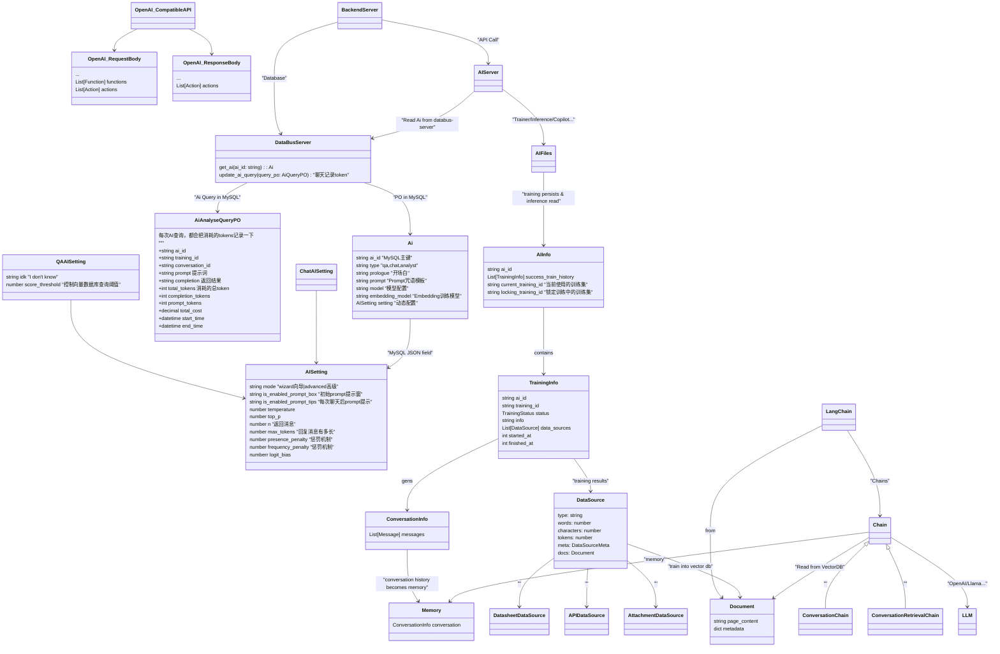
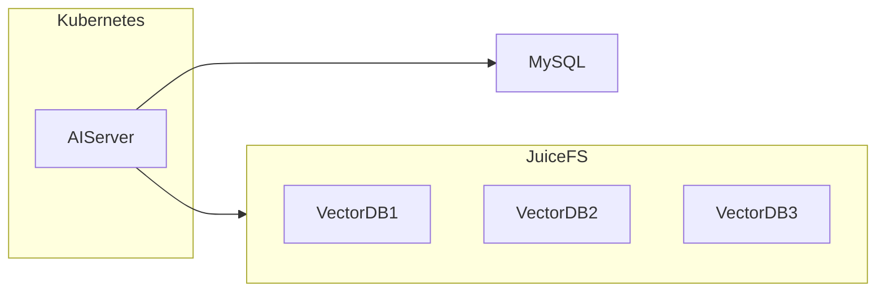

## Data Structs 数据结构
> [Back](../README.md)

> [Code](../ai_shared/)

### Data Structs Map

> AI Server所有的持久化数据结构，保存在文件系统，即硬盘里。
> 在执行`make test`后，你可以在ai/.data/看到所有的AI训练、推理、Conversation文件。
> 下图AI-Files为持久化的文件



### File Persistent & Data Storage Strategy 持久化策略

In the production environment, we use [JuiceFS](https://juicefs.com/), a distributed POSIX file system, to store persisted models.

All persistent data is stored in the `.data` directory. You can find more details about this in the [persist](./ai_server/shared/persist) Python module.

The persisted folder structure is as follows:

```text
- {ai_id}/
   - info.json
   - {training_id}/
      - info.json
      - conversations/
         - {conversation_id}.json
      - vector.db
```

So, you can get infromation from these files, like:

- AI Info
- Traning Info
  - get list
  - Status: Success | Failed | Training
- Conversation Info
  - get list

### Data Source

概念：DataSource 数据源，用于 Training 过程中，记录下对某个数据源的训练历史。

```
DataSource:
- type: string
- type_id: string
- hash: string
- documents:Lang Chain Document

举例：

- type: PDF
- type_id: 文件名
- hash： 文件MD5
- documents：  LangChain PDFLoader

---

- type: datasheet
- type_id: datasheet_id
- hash： revision
- documents：  APITableLoader

```

应用场景：

比较是否需要重新训练？
判断双方的 Data Source 的 hash 是否一致。

比照如表:

| Vika Data | Training Data |
| --------- | ------------- |
| Record    | Document      |
| Datasheet | Data Source   |

### Prompting Format

Here's the AI table model:

- `type`: QA, Chat
- `prologue`: The opening remarks
- `prompt`: text, a prompt with variables ({context}, {question}) to send to LLM
- `settings`: JSON, frontend AI settings
  - enabled_prompt_box
  - enabled_prompt_tips

room-server 中间层，只做上面配置的转发，交给 AIServer 去做，不同的 type bot，有不同的 prompt 变量。

详情不同的 type 的不同的 JSON Settings 表：
https://apitable.getoutline.com/doc/ai-bot-type-prompt-settings-HB0gWbplEQ

### Vector Database Document Persistent Strategy

```python
class Document:

  page_content="""
  field2: second column content
  field3: third column content
  ...
  """

  metadata={
    "id": record.primary_key(),
    "source": record.primary_key(),
    "suggestion:" "出现在prompt window的suggestion",
    "type": "datasheet",
    "datasheet_id": dst_id,
    "record_id": record.id,
  }
```

### Vector Database Files Persistent Strategy

We have millions of "Chatbot" tenants, each with a different documents, collection schema, and vectors to process.

To handle this, we use `ChromaDB` for local file persistence.

Each training session generates a new ChromaDB file with the name `ai_server_{AI_ID}_{DATETIME}`.

This ensures that each training session has its own unique file for storing the vectors, making it easier to manage and access them later.



### Table Database -> Loader & Embedding -> Vector Database

| Table Components | Loader          | Desc                                    |
| ---------------- | --------------- | --------------------------------------- |
| Q & A            | QALoader        | Q and A robot                           |
| Attach(PDF)      | PDFLoader       | Auto Q&A split robot                    |
| Button           | FunctionsLoader | Functions                               |
| URL              | URLLoader       | Web Scrawler                            |
| Form             | AIForm          | Positive chat                           |
| View             | Roll Polling    | Positive chat within a table one by one |
