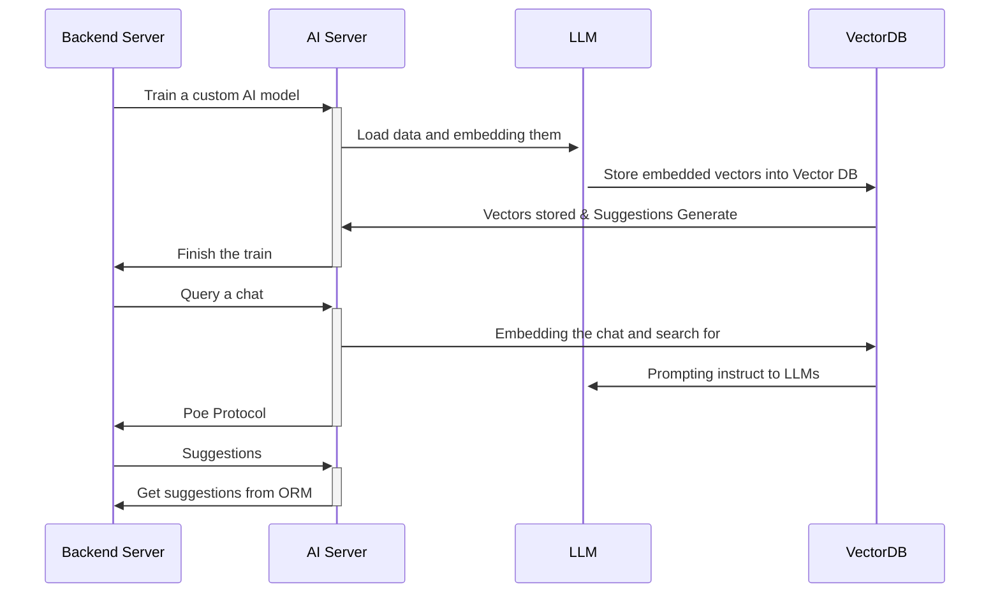
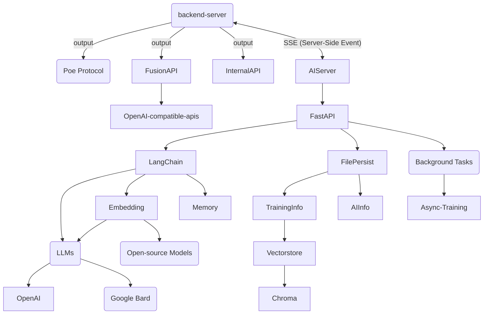
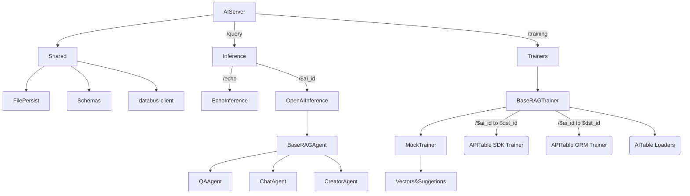
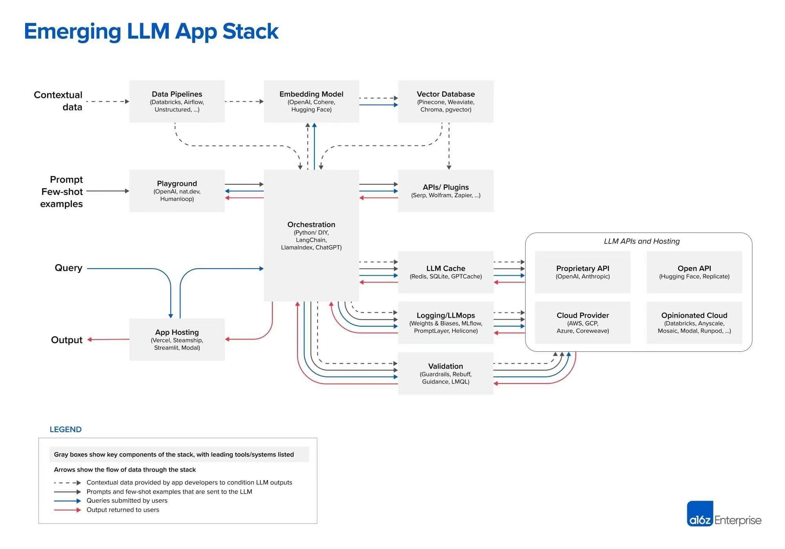

# Infrastructure 架构与基础数据流
> [Back](../README.md)

## Concepts & Modules

三个基本词语:

- **Inference/推理者**: Handle query chats, such as LLMs text, Image Generators and so on.
- **Trainer/训练者**: Train an embedding models.
- **Copilot/AI助手**: AITable软件内右侧边栏的AI助手

AIServer includes the following features and coding modules:

- Training Module
  - For training a model via APITable's data (`/ai/trainers/`)
  - Different trainers
  - Communicating with different LLMs
    - OpenAI
    - Google Bard / PaLM
  - Loader & Embedding
    - Vika API / APITable API Loader
    - APITable ORM Loader
    - PDF Loader
    - ...
  - Refiner
    - Refine a table from attachments like PDF to table, Word to table.
    - `/ai/trainers/refiners/`
- Inference Module
  - Respond the users' querying chat (`/ai/inference/`)
  - Different inferences
  - Implement Poe Protocol
- Shared Module
  - Data structs & persistent
  - Celery, async tasks
  - Shared libs, helpers and utils.

## Python modules dependencies
```
└── ai_server
  └── ai_shared
    └── databus_client
  └── ai_inference
    └── ai_shared
      └── databus_client
  └── ai_trainers
    └── ai_shared
      └── databus_client
```


## Services Flow



## Frameworks & Infrastructure

AIServer consist of multi open-source framework, this flowchart shows how we should use.



## Development Components

> 注意了，我们的Loader不同于LangChain的Loader
> 我们的Loader，是返回DataSource的； 
> LangChain的Loader返回Document




### Emerging LLM App Stack



