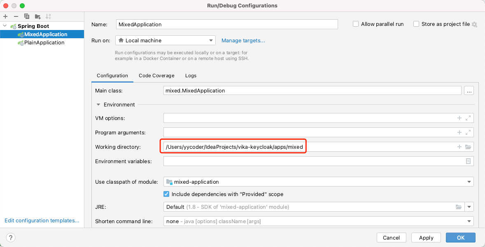

# Vika & Keycloak

**Vika** & **Keycloak** 集成项目，将Keycloak服务运行在SpringBoot框架上，意在为前后端开发人员提供一个良好的开发环境

## 环境要求

* [SDKMAN](https://sdkman.io/)

## 初始化环境

```shell
# 在工程目录下执行以下命令
# 1. 初始化工程对应的Java版本环境
$ sdk env
# 2. 查看java环境
$ java -version
```

## 预定义开发环境说明

### Realm领域配置
为了与线上环境的``Realm``配置保持一致，而不会让开发环境造成污染，已将开发环境的Realm文件导出，内嵌Keycloak服务启动时会自动将Realm配置导入到本地开发环境，配置在 [development-realm-config.json](./development-realm-config.json) 文件里，而``development-realm-config.json``已经配置到[mixed](./apps/mixed)应用的配置文件内 [application.yml](./apps/mixed/src/main/resources/application.yml)

## 前端开发

主要以开发自定义Theme为主，因为前端不懂后端框架，开发人员工作目录集中在``extensions/themes/src/main/resources``
即可，每次修改``*.ftl``之后，调试运行``sh ./debug.sh``，启动完成后，打开
`` http://localhost:8080/auth ``即可看到，开发调试打开：[维格通行证](http://127.0.0.1:8080/auth/realms/integration/protocol/openid-connect/auth?client_id=vika-user-confidential&redirect_uri=http%3A%2F%2F127.0.0.1%3A8080%2Fauth%2Frealms%2Fintegration%2Faccount%2Flogin-redirect&state=0%2Fee573ad7-89a0-4b96-8e10-12efbe073c67&response_type=code&scope=openid)

## 后端开发

专注自定义Provider开发....

### 打包

```shell
$ ./mvnw clean install
```

### 运行

简单应用

```shell
cd apps/plain
mvn spring-boot:run
```

复杂应用

```shell
cd apps/mixed
mvn spring-boot:run
```
### FAQs

Q.Spring Boot Services启动无法导入realm文件

A.设置启动working directory



### TODO Task List

- [ ] Provider模块、Theme模块自动化部署CI/CD
- [ ] 建立完整的迭代工作流，版本化

