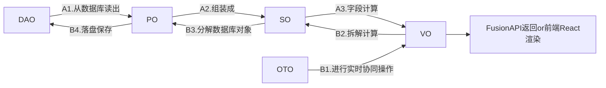
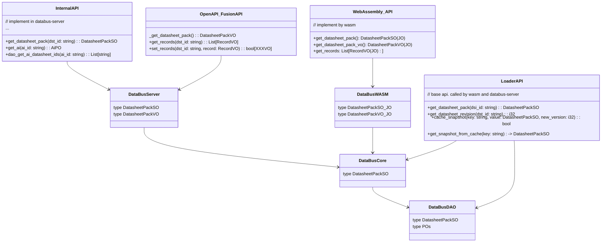
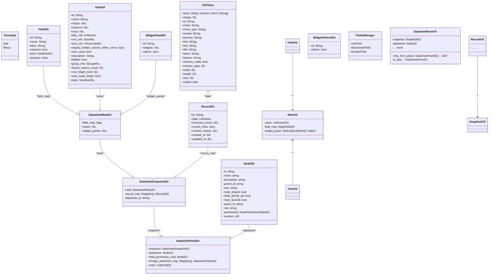
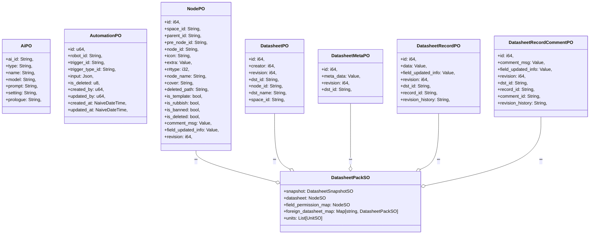
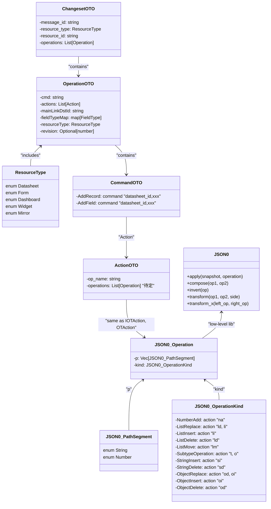
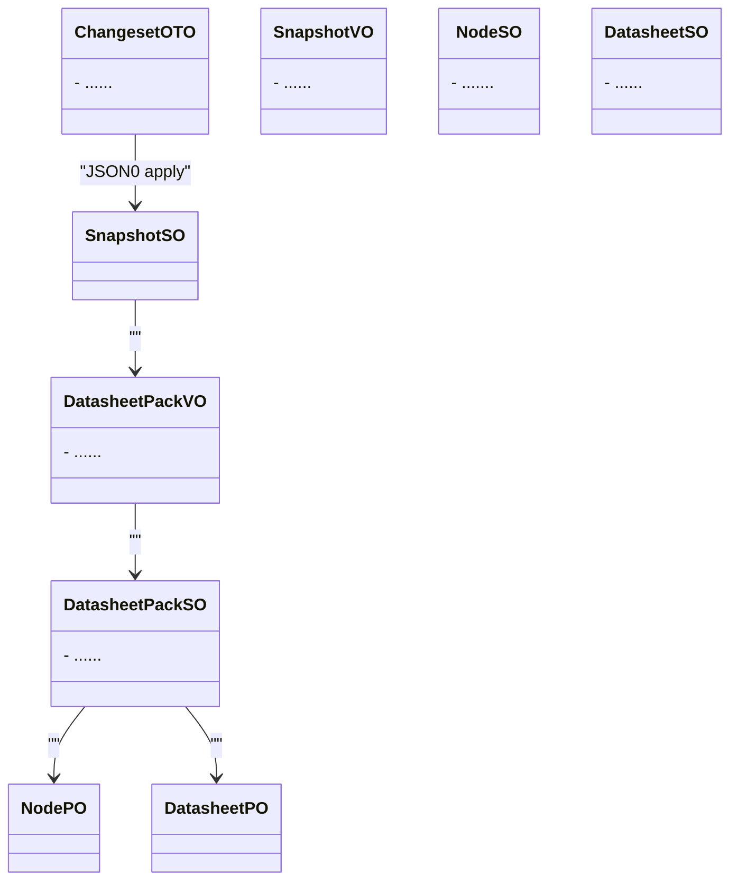

# DataBus Data Struct数据结构

> [Back](../README.md)

## Programming Layers

[DDD 领域驱动设计：贫血模型和充血模型](https://zhuanlan.zhihu.com/p/464914100)
我们倾向于充血模型，Domain Logic 是函数过程式，便于提供给 Facade 门面。
Business Logic 是 OOP 面向对象模式，基于 Domain Logic。

| Layers                     | Data Object Acronyms                  | Code Files   | Code Traits                                                                 | Data Struct |     |
| -------------------------- | ------------------------------------- | ------------ | --------------------------------------------------------------------------- | ----------- | --- |
| Facade                     | NodeJS,Python,Java,REST-API,WidgetSDK | /databus-wasm|/databus-server | Native Binding, napi,PyO3, wasm, JNI, REST-API                              | ::init() |
| Business Logic             | BO(Business Object)                   | (暂不实现)       | Pure OOP, Widget SDK,do not implement in Rust                               | SpaceBO |
| Domain Logic               | SO(Service Object)                   | /databus-core/so/\*       | Functional Programming, get_datasheet_pack, add_records, etc.               | DatasheetPackSO |
| Operational Transformation | OTO                                   | /databus-core/ot/\*       | JSON0-based, `command`, `action`, `operation`, `changeset`, `OPEvent`, etc. | Commands, Snapshot |
| Persistent Logic           | DAO + PO                              | /databus-dao-db/\*      | `RecordDAO`, `RecordPO`, `RecordEntity`,Repository                          | DatasheetPackSO = PO + PO |
| Infrastructure             | Shared static classes                 | /databus-shared/\*   | macros, utils, helpers, libs, shared types                                  | ::prelude::* |

## Data Object Acronyms

Prior to developing DataBus, it is important to understand the various acronyms of `Data Objects`.

| Acronym        | Definition                                                                                                                                                                             |
| -------------- | -------------------------------------------------------------------------------------------------------------------------------------------------------------------------------------- |
| DTO            | Data Transfer Object. A design pattern used to transfer data between software application subsystems.                                                                                  |
| <u>**DAO**</u> | Data Access Object. A design pattern that provides an abstract interface to some type of database or other persistence mechanism.                                                      |
| <u>**PO**</u>  | Persistent Object. An object that is stored in a database and retains its state even after the application that created it has terminated.                                             |
| <u>**OTO**</u> | Operational Transformation Object. Snapshot, Command, Operation, Action, etc.                                                                                                          |
| <u>**SO**</u>  | Service Object. An object that provides a specific service or functionality to other objects or components within an application: DatasheetPack, DatashetPackManager, etc.             |
| <u>**BO**</u>  | Business Object. An object that represents a business entity or concept, such as a customer, order, or product.                                                                        |
| VO             | View Object. An object that represents a value or set of values, but does not have any behavior associated with it. Typically used to transfer data between layers of an application. |

> Table above generated by ChatGPT.

There's only **DAO / PO / OTO / SO** in `DataBus-core`, **BOs** in `DataBus-bindings`.

Let's simplify them for better understanding:

## Data Structure Class Diagram

### Service Objects & OT Objects & JSON0 & Persistent Objects

通常的后端编程，从数据库获取PO后，就转变成VO或DTO，返回给请求端了。
但是我们是实时协同，这里发生了更复杂的对象拆分和转换。

- PO: Persistent Object，持久化数据库里的；
- SO: Service Objects，内存里的，做关联计算的；
- OTO: OT Objects，做OT算法操作修改的；
- JSON0: 底层库
- JO: 是打了#[wasm_bindgen] 宏tag的结构体，专门用于WebAssembly接口返回，它通常映照VO、SO。

以下是各种数据流程，方便你理解。

### `APIs`接口加载何种`DatasheetPack`，并返回`VOs`

### `DatasheetPackSO` 经过字段计算形成 `DatasheetPackVO`

经过字段计算，生成DatasheetVO。
DatasheetVO，是计算之后，前端React，可直接用来渲染的。

何为没有经过**字段计算**？（SO）

1. 关联字段的关联整个record，而不是可直接渲染的文本信息
2. 单选字段，仍然是"opt_"开头值的ID，而不是可渲染的文本信息
3. 公式字段，仅仅是公式，而不是可渲染的文本信息
4. ....

### `数据库POs` 组装成 `DatasheetPackSO`

### `OTO` (Operational Transform Objects) 组合和封装 `JSON0`

增删改生成changeset。

### 从`OTO`应用修改 -> `DatasheetPackVO` -> `DatasheetPackSO` -> `POs`

增/删/改流程，应用Changeset。

