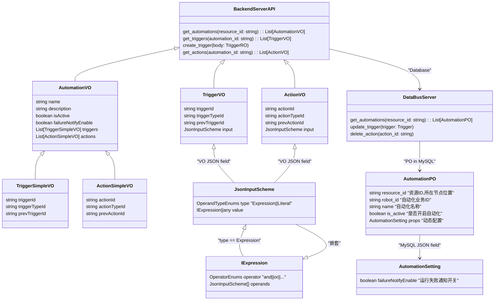

## Data Structs 数据结构

### Data Structs Map

```mermaid

classDiagram
    BackendServerAPI <|-- AutomationVO
    BackendServerAPI <|-- TriggerVO
    BackendServerAPI <|-- ActionVO
    class BackendServerAPI {
        get_automations(resource_id: string): List[AutomationVO]
        get_triggers(automation_id: string): List[TriggerVO]
        create_trigger(body: TriggerRO)
        get_actions(automation_id: string): List[ActionVO]
    }
    class AutomationVO {
      string name
      string description
      boolean isActive
      boolean failureNotifyEnable
      List[TriggerSimpleVO] triggers
      List[ActionSimpleVO] actions
    }
    AutomationVO <|-- TriggerSimpleVO
    AutomationVO <|-- ActionSimpleVO
    class TriggerSimpleVO {
      string triggerId
      string triggerTypeId
      string prevTriggerId
    }
    class ActionSimpleVO {
      string actionId
      string actionTypeId
      string prevActionId
    }

    class TriggerVO {
      string triggerId
      string triggerTypeId
      string prevTriggerId
      JsonInputScheme input
    }
    class ActionVO {
      string actionId
      string actionTypeId
      string prevActionId
      JsonInputScheme input
    }
    TriggerVO <|-- JsonInputScheme: "VO JSON field"
    ActionVO <|-- JsonInputScheme: "VO JSON field"
    class JsonInputScheme {
      OperandTypeEnums type "Expression||Literal"
      IExpression||any value
    }
    JsonInputScheme <|-- IExpression: "type == Expression"
    class IExpression {
      OperatorEnums operator "and||or||..."
      JsonInputScheme[] operands
    }
    IExpression <|-- JsonInputScheme: "嵌套"

    BackendServerAPI --> DataBusServer: "Database"
    class DataBusServer {
        get_automations(resource_id: string): List[AutomationPO]
        update_trigger(trigger: Trigger)
        delete_action(action_id: string)
    }
    DataBusServer --> AutomationPO: "PO in MySQL"
    class AutomationPO {
      string resource_id "资源ID,所在节点位置"
      string robot_id "自动化业务ID"
      string name "自动化名称"
      boolean is_active "是否开启自动化"
      AutomationSetting props "动态配置"
    }
    AutomationPO --> AutomationSetting: "MySQL JSON field"
    class AutomationSetting {
      boolean failureNotifyEnable "运行失败通知开关"
    }


```