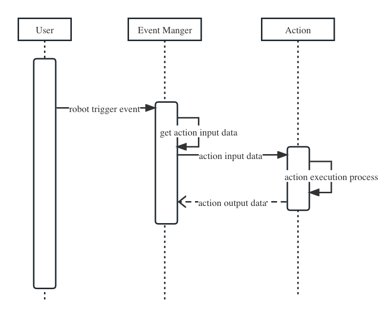

English | [中文](../zh-CN/how-to-create-automation-action.md)

## Quick start

APITable supports extending the robot's operations by creating custom automation actions. [Robot official website introduction](https://help.apitable.com/docs/guide/manual-automation-robot/).

### Step 1. Create a file

Create file `xxx.action.ts` and place it under folder `apitable/packages/room-server/src/automation/actions`.

### Step 2. Create an implementation class

In the new file, create `IBaseAction` implementation class and annotate `@AutomationAction`.

```typescript
@AutomationAction("Xxx")
export class XxxAction implements IBaseAction {
  async endpoint(input: any): Promise<IActionResponse<any>> {
    console.log(`Entry customer connector. the input is ${input.info}`)
    return Promise.resolve(undefined);
  }

  getInputSchema(): IJsonSchema {
    return {
      type: "object",
      properties: {
        info: {
          type: "string",
          title: "info"
        }
      }
    };
  }

  getOutputSchema(): IJsonSchema {
    return { };
  }

  getUISchema(): IUiSchema {
    return { };
  }
}
```

### Step 3. Import the robot action into the application

```diff
// apitable/packages/room-server/src/automation/actions/index.ts
+ import { XxxAction } from "./xxx.action";

@Module({
  imports: [
+    XxxAction
  ],
})
export class AutomationActionModule {}
```

## Tutorial

### Robot execution process

The robot will automatically execute the specified operation according to the preset trigger conditions, so that the repetitive work flow can be automated. The robot connects the data in the datasheet with various business systems and apps.



In the interface `IBaseAction`:
- `endpoint(input: any): Promise<IActionResponse<any>>` defines the action execution process
- `getInputSchema(): IJsonSchema` defines the data structure of the action input parameter
- `getOutputSchema(): IJsonSchema` defines the data structure of the action output parameter
- `getUISchema(): IUiSchema` defines the action UI interface

`getInputSchema(): IJsonSchema` and `getUISchema(): IUiSchema` determines the UI interface of the robot action configuration. 

### How to write InputSchema, OutputSchema or UISchema? 

InputSchema, OutputSchema and UISchema is [JSON Schema](https://json-schema.org/). JSON Schema is a declarative language that allows you to annotate and validate JSON documents. Because the robot's form engine is based on [react-jsonschema-form](https://github.com/rjsf-team/react-jsonschema-form), so `IJsonSchema`和`IUiSchema` can refer [rjsf documentation](https://react-jsonschema-form.readthedocs.io/en/latest/).
