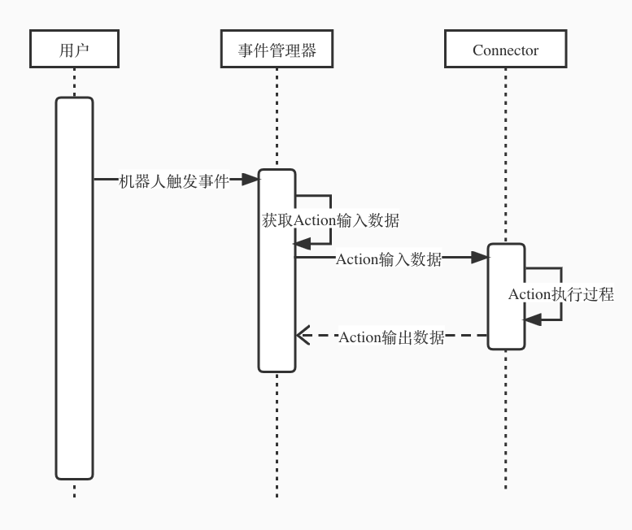

[English](../en-US/how-to-create-automation-action.md) | 中文

## 快速开始

APITable支持通过创建自定义自动化动作来扩展机器人的操作。机器人[官网介绍](https://help.vika.cn/docs/guide/manual-automation-robot/)。

### 步骤1. 创建文件

创建文件`xxx.action.ts`，将它放到文件夹`apitable/packages/room-server/src/automation/actions`下。

### 步骤2. 创建一个实现类

新建文件中，创建`IBaseAction`实现类并加上`@AutomationAction`注解。

```typescript
@AutomationAction("Xxx")
export class XxxAction implements IBaseAction {
  async endpoint(input: any): Promise<IActionResponse<any>> {
    console.log(`Entry customer connector. the input is ${input.info}`)
    return Promise.resolve(undefined);
  }

  getInputSchema(): IJsonSchema {
    return {
      type: "object",
      properties: {
        info: {
          type: "string",
          title: "info"
        }
      }
    };
  }

  getOutputSchema(): IJsonSchema {
    return { };
  }

  getUISchema(): IUiSchema {
    return { };
  }
}
```

### 步骤3. 将机器人自定义动作导入应用中

```diff
// apitable/packages/room-server/src/automation/actions/index.ts
+ import { XxxAction } from "./xxx.action";

@Module({
  imports: [
+    XxxAction
  ],
})
export class AutomationActionModule {}
```

## 教程

### 机器人执行流程

机器人将按照预设的触发条件，自动执行指定操作，让重复性的工作流程实现自动化执行。机器人将表里的数据与各种业务系统、APP连接起来。



在接口`IBaseAction`中:
- `endpoint(input: any): Promise<IActionResponse<any>>`定义action执行过程
- `getInputSchema(): IJsonSchema`返回值定义action输入参数的数据结构
- `getOutputSchema(): IJsonSchema`返回值定义action输出参数的数据结构
- `getUISchema(): IUiSchema`返回值定义前端UI界面

`getInputSchema(): IJsonSchema` and `getUISchema(): IUiSchema`决定了机器人动作配置的UI界面。

### 输入参数、输出参数、UI界面如何写？

输入参数、输出参数、UI界面的数据结构是通过[JSON Schema](https://json-schema.org/)描述。JSON Schema是一种声明性语言，允许您定义和验证JSON文档的数据格式。由于机器人的表单引擎基于[react-jsonschema-form](https://github.com/rjsf-team/react-jsonschema-form)，所以`IJsonSchema`和`IUiSchema`取值可以参考[rjsf的官方文档](https://react-jsonschema-form.readthedocs.io/en/latest/)。、
