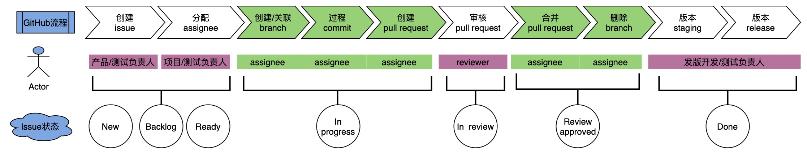

# Vikadata github process

    

## 创建project item及同步为issue

> 通过GitHub Docs了解更多： [创建issue](https://docs.github.com/en/issues/tracking-your-work-with-issues/creating-an-issue)。

1. ### 角色

* 需求类：产品负责人（胡峰）
* bug类：测试负责人（彭进）

2. ### 前提

* 需求类：pbr会议上确认可纳入研发迭代的需求
* bug类：测试同学已经验证并且确定是要修复的bug

3. ### 操作路径

* 打开vikadata project，点击底部➕右侧文本框，按规范编写issue标题，点击enter，即可录入item（此时为草稿，并未有对应的仓库）。
* 鼠标来到草稿item编号左侧，显示了下拉标识后点击，点击convert to issue，选择仓库vikadata，即可转成issue。
* 点击issue名称，即可弹出issue填写框，编辑相应信息即可（description、status、labels）。
* 如assignees、iteration等其他信息已知，请直接补充。

⚠️通过project创建的issue，记得补充完整description信息（这里是木有issue模版里的描述提示）。

## 分配assignee

1. ### 角色

* 需求类：项目负责人（心如）（也可由对应的产品同学来）
* bug类：测试负责人（彭进）（也可由对应的测试同学来）

2. ### 前提

* 需求类：计划会议上确认可纳入研发迭代的需求
* bug类：测试同学已经验证并且确定是要修复的bug

3. ### 操作路径

* 打开vikadata project，搜索对应的issue进行assignees的补充以及其他信息的补充。

## issue创建branch或关联branch

> 使用一个分支来隔离开发工作，而不影响仓库中的其他分支。每个仓库都有一个默认分支，并且可以有多个其他分支。你可以使用分支在仓库的包含区域中开发功能、修复错误或实现其他新想法。通过GitHub Docs了解更多： [创建branch](https://docs.github.com/en/pull-requests/collaborating-with-pull-requests/proposing-changes-to-your-work-with-pull-requests/creating-and-deleting-branches-within-your-repository)。

1. ### 角色：assignee

2. ### 前提

* 需求类：计划会议上确认可纳入研发迭代的需求
* bug类：测试同学已经验证并且确定是要修复的bug

3. ### 操作路径

> 其他路径可通过GitHub Docs了解更多： [创建branch](https://docs.github.com/en/pull-requests/collaborating-with-pull-requests/proposing-changes-to-your-work-with-pull-requests/creating-and-deleting-branches-within-your-repository)。

#### 场景1：issue尚未有分支

* 打开vikadata Issues，搜索对应的issue，进入issue页面，点击右侧Development "Create a branch"，更新Branch name，点击Create branch即可创建成功，此时issue与分支已关联上。

#### 场景2：issue已有分支或pull request

* 打开vikadata Issues，搜索对应的issue，进入issue页面，点击右侧Development的设置图标，选择仓库vikadata，输入名称搜索对应的已有分支或者pull request，在下拉选项中点击对应的分支或pull request勾选上，点击Apply即可关联上分支或者pull request。

⚠️这里是一个issue可以关联多个分支或者pull request的，同时一个分支或者pull request也可关联多个issue的。

⚠️当分支创建pull request时，issue关联的分支就会转变为其pull request。

## 过程commit

1. ### 角色：assignee

2. ### 前提：

已关联需要处理的issue的分支

3. ### 操作路径：

#### 路径1：
* 打开gitpod，打开对应分支，进行对应issue的代码编译
* 时不时进行commit：点击右侧图标Source Control，按规范编写commit标题，要以chore:/feat:/fix:等开头（具体请参考[Conventional Commits](https://www.conventionalcommits.org/en/v1.0.0/)），点击Commit，点击Yes，点击Sync Changes 1即可成功同步分支至GitHub vikadata仓库。

#### 其他路径开发自行决定

## 创建pull request

> 使用pull request将一个分支合并到另一个分支。通过GitHub Docs了解更多： [创建pull request](https://docs.github.com/en/pull-requests/collaborating-with-pull-requests/proposing-changes-to-your-work-with-pull-requests/creating-a-pull-request)

1. ### 角色：assignee

2. ### 前提

已关联issue的分支，其代码有改动或者已完成改动

3. ### 操作路径

#### 路径1：

* 打开vikadata Code，在“Branch”菜单栏中，搜索你要pull request的分支，点击此分支名进入分支file页面。
* 点击contribute右侧下拉选项，点击open pull request。
* 进入创建pull request页面，确认compare与base分支名无误，按规范编写pull request标题及其描述（请参考[Conventional Commits](https://www.conventionalcommits.org/en/v1.0.0/)），补充Assignees、Labels、Projects、Development信息，如果有指定的Reviewers，亦须关联上。
* 点击Create Pull Request即可创建并打开pull request。（如果pr还未准备好，可以创建Draft pull request，可暂时不关联reviewers，待准备好再打开并关联reviewers）。

#### 路径2：

* 打开vikadata Pull requests，进入Pull requests列表页面，点击右侧New pull request，compare与base选择对应的分支，点击右侧Create pull request。
* 进入创建pull request页面，确认compare与base分支名无误，按规范编写pull request标题及其描述（请参考[Conventional Commits](https://www.conventionalcommits.org/en/v1.0.0/)），补充Assignees、Labels、Projects、Development信息，如果有指定的Reviewers，亦须关联上。
* 点击Create Pull Request即可创建并打开pull request。（如果pr还未准备好，可以创建Draft pull request，可暂时不关联reviewers，待准备好再打开并关联reviewers）。

4. ### 注意事项

为了增加你的拉取请求被通过的几率，请确保你的拉取请求遵循以下准则：

- 提交消息满足格式指南。
- 标题和描述与你的实现（改动）相匹配。
- 至少有一个相关的issue。
- 已经通过相关测试。
- 已经解决相关冲突。

## 审核pull request

> 在拉取请求中，你可以查看和讨论commits、更改的文件以及基础和比较分支中文件之间的差异。通过GitHub Docs了解更多： [审核pull request](https://docs.github.com/en/pull-requests/collaborating-with-pull-requests/reviewing-changes-in-pull-requests/reviewing-proposed-changes-in-a-pull-request)。

1. ### 角色：reviewer

2. ### 前提

Pull request已打开（完成了代码改动）

3. ### 操作路径

* 打开vikadata Pull requests，进入Pull requests列表页面，点击你要审核的pull request，进入该pull request详情页面。
* 点击Files changed进行文档审核，点击对应代码行左侧+填写修改意见，点击Start a review，继续审核，点击对应代码行左侧+填写修改意见，点击Add review comment，直至完成审核。
* 如果已经完成了所有审核，点击右上角Finish your review/Review changes，填写评论，总结你对该pr更改的反馈。
* 选择你此次审核的结果类型，点击Submit review。审核结果类型分以下三类：
  
  * Comment：留下一般反馈，但没有明确是否批准合并pull request或者是否仍需进行代码修改。
  * Approve：提交反馈，并批准合并pull request中提出的更改。（这里assignee就可以进行合并pull request了）
  * Request changes：提交反馈，要求在合并pull request之前必须解决反馈的问题。

## 合并pull request

> 通过GitHub Docs了解更多：[合并pull request](https://docs.github.com/en/pull-requests/collaborating-with-pull-requests/incorporating-changes-from-a-pull-request/merging-a-pull-request)。

1. ### 角色：assignee

2. ### 前提

已review approved，不需再修改代码

3. ### 操作路径

* 进入对应的pull request页面，点击Merge pull request下拉项，选择Squash and merge，点击**Squash and merge**，编辑或更新标题及描述，点击Confirm squash and merge。

## 删除branch

> 在pull request合并后，如果仓库没有默认配置[自动删除分支](https://docs.github.com/en/articles/managing-the-automatic-deletion-of-branches)，你可以手动删除分支。通过GitHub Docs了解更多：[删除branch](https://docs.github.com/en/pull-requests/collaborating-with-pull-requests/proposing-changes-to-your-work-with-pull-requests/creating-and-deleting-branches-within-your-repository)。

1. ### 角色：assignee
2. ### 前提

需求或者bug的分支已合并至指定分支

3. ### 操作路径

* 打开vikadata仓库主页，点击Branches，搜索你要删除的分支，点击其右侧删除符号即可删除分支。

⚠️如果你尝试删除的分支，还与一个或者多个仍是open状态的pull request(s)关联的，则必须确认你打算关闭这个或这些pull request(s)后才能删除分支。

## 版本staging

1. ### 角色：发版负责人
2. ### 前提

integration已产品及测试验收通过

3. ### 操作路径

* **创建release分支：** 从develop分支创建release分支，以`release/{版本号}`作为格式规范，例如“`release/0.13.6`”（下面描述均以0.13.6示例）。
* **release分支打tag：** 打开vikadata code主页，点击tags，进入tags列表页面，点击Releases切换至releases列表页面，点击Draft a new release，选择Target分支为“`release/0.13.6`”，点击Choose a tag，搜索框上填写“v0.13.6-rc”，点击Create new tag，填写release title为“v0.13.6-rc”，点击下方Publish release，此时已打完tag，并触发自动化部署至staging。
* **通知staging验收：** 等actions跑完后，到产研项目群里通知测试及产品发版负责人进行staging验收。
* **develop分支上升版本号：** 从 develop 分支创建一个临时分支，然后更新 `.version` 和 `package.json` 这两个文件，将 "0.13.6" 改为 "0.13.7" ，提交pr合并至develop分支。
* 期间有bug修复，则开发各自新建分支进行修复再提交pull request合并至release分支，开发沟通协调视情况而定继续打tag，同上述打tag操作将最新代码自动化部署至staging验收，注意tag号须逐步上升“v0.13.6-rc.1”、“git tag v0.13.6-rc.2”、“git tag v0.13.6-rc.3”……

## 版本release

1. ### 角色：发版负责人

2. ### 前提

staging已产品及测试验收通过且飞书发版申请流程已通过

3. ### 操作路径

* **release分支打tag：** 打开vikadata code主页，点击tags，进入tags列表页面，点击Releases切换至releases列表页面，点击Draft a new release，选择Target分支为““`release/0.13.6`”，点击Choose a tag，搜索框上填写“v0.13.6-release”，点击Create new tag，填写release title为“v0.13.6-release”，点击右侧Generate releases note，自动将相关的变更信息补充至描述框内，此时仍需要手工润饰和修改下，最后点击下方Publish release，此时已打完tag，但注意此时并不会自动化部署production。
* **推动部署上线：** 等到actions跑完后，打开ops-manager仓库，找到对应的版本 issue，推动其中两个assignee**回复yes** **，** 则代表版本可以继续部署上线（Respond "approved", "approve", "lgtm", "yes" to continue workflow or "denied", "deny", "no" to cancel.）。
* **通知线上验收：** 观察确认版本issue状态已为close或者阿里云容器已更新完成，则代表部署已经完成，到产研项目群里通知测试及产品发版负责人进行线上验收。
* **release分支合并至develop分支** 。github界面创建一个pull request，提出从“`release/{版本号}`”合并到“develop”分支的请求，然后review并merge。
* **release分支合并至master分支** ：github界面创建一个pull request，提出从“`release/{版本号}`”合并到“masterr”分支的请求，然后review并merge。

## 其他选修

Managing labels：[标签管理](https://docs.github.com/en/issues/using-labels-and-milestones-to-track-work/managing-labels)

Closing a pull request：[关闭pr](https://docs.github.com/en/pull-requests/collaborating-with-pull-requests/incorporating-changes-from-a-pull-request/closing-a-pull-request)

Viewing issues and pull requests：[快速查看你的issue跟pr](https://docs.github.com/en/issues/tracking-your-work-with-issues/viewing-all-of-your-issues-and-pull-requests)
