# Database Schema

## user domain

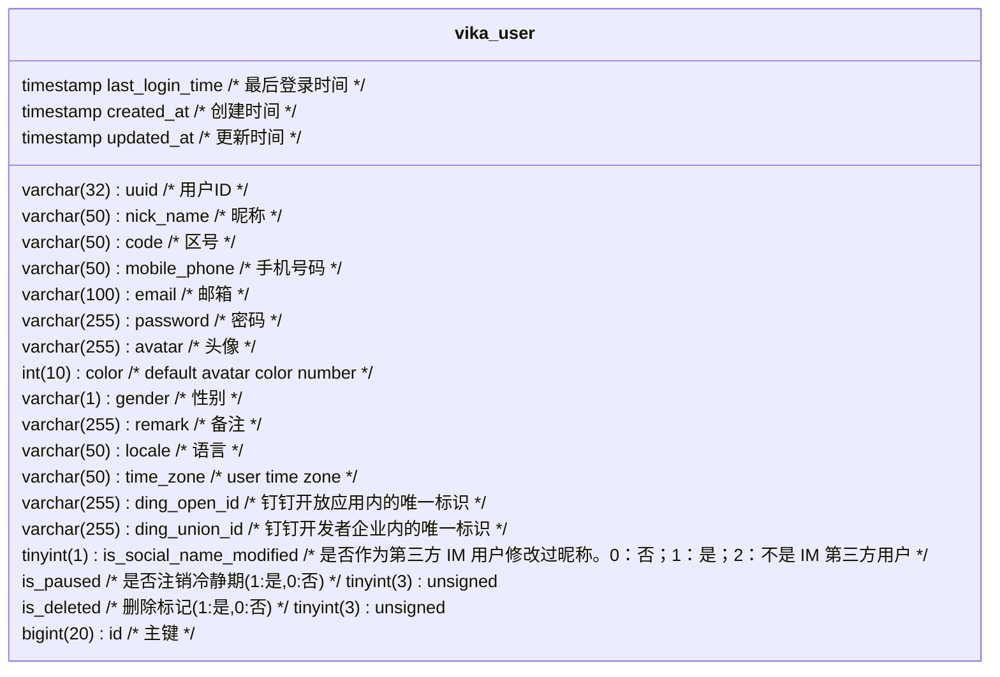
```mermaid
classDiagram
direction BT
class vika_user {
   varchar(32) uuid  /* 用户ID */
   varchar(50) nick_name  /* 昵称 */
   varchar(50) code  /* 区号 */
   varchar(50) mobile_phone  /* 手机号码 */
   varchar(100) email  /* 邮箱 */
   varchar(255) password  /* 密码 */
   varchar(255) avatar  /* 头像 */
   int(10) color  /* default avatar color number */
   varchar(1) gender  /* 性别 */
   varchar(255) remark  /* 备注 */
   varchar(50) locale  /* 语言 */
   varchar(50) time_zone  /* user time zone */
   varchar(255) ding_open_id  /* 钉钉开放应用内的唯一标识 */
   varchar(255) ding_union_id  /* 钉钉开发者企业内的唯一标识 */
   timestamp last_login_time  /* 最后登录时间 */
   tinyint(1) is_social_name_modified  /* 是否作为第三方 IM 用户修改过昵称。0：否；1：是；2：不是 IM 第三方用户 */
   is_paused  /* 是否注销冷静期(1:是,0:否) */ tinyint(3) unsigned
   is_deleted  /* 删除标记(1:是,0:否) */ tinyint(3) unsigned
   timestamp created_at  /* 创建时间 */
   timestamp updated_at  /* 更新时间 */
   bigint(20) id  /* 主键 */
}
```

## space domain

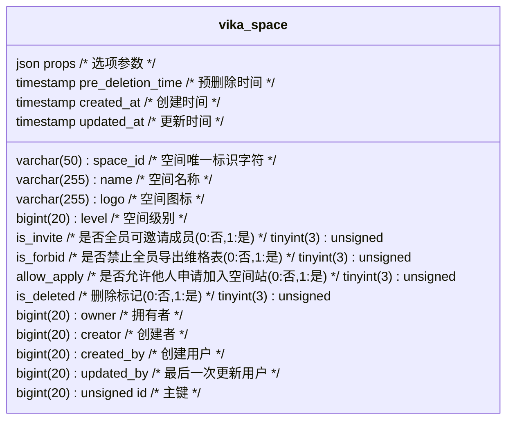
```mermaid
classDiagram
direction BT
class vika_space {
   varchar(50) space_id  /* 空间唯一标识字符 */
   varchar(255) name  /* 空间名称 */
   varchar(255) logo  /* 空间图标 */
   bigint(20) level  /* 空间级别 */
   json props  /* 选项参数 */
   timestamp pre_deletion_time  /* 预删除时间 */
   is_invite  /* 是否全员可邀请成员(0:否,1:是) */ tinyint(3) unsigned
   is_forbid  /* 是否禁止全员导出维格表(0:否,1:是) */ tinyint(3) unsigned
   allow_apply  /* 是否允许他人申请加入空间站(0:否,1:是) */ tinyint(3) unsigned
   is_deleted  /* 删除标记(0:否,1:是) */ tinyint(3) unsigned
   bigint(20) owner  /* 拥有者 */
   bigint(20) creator  /* 创建者 */
   bigint(20) created_by  /* 创建用户 */
   bigint(20) updated_by  /* 最后一次更新用户 */
   timestamp created_at  /* 创建时间 */
   timestamp updated_at  /* 更新时间 */
   bigint(20) unsigned id  /* 主键 */
}
```

## workspace domain

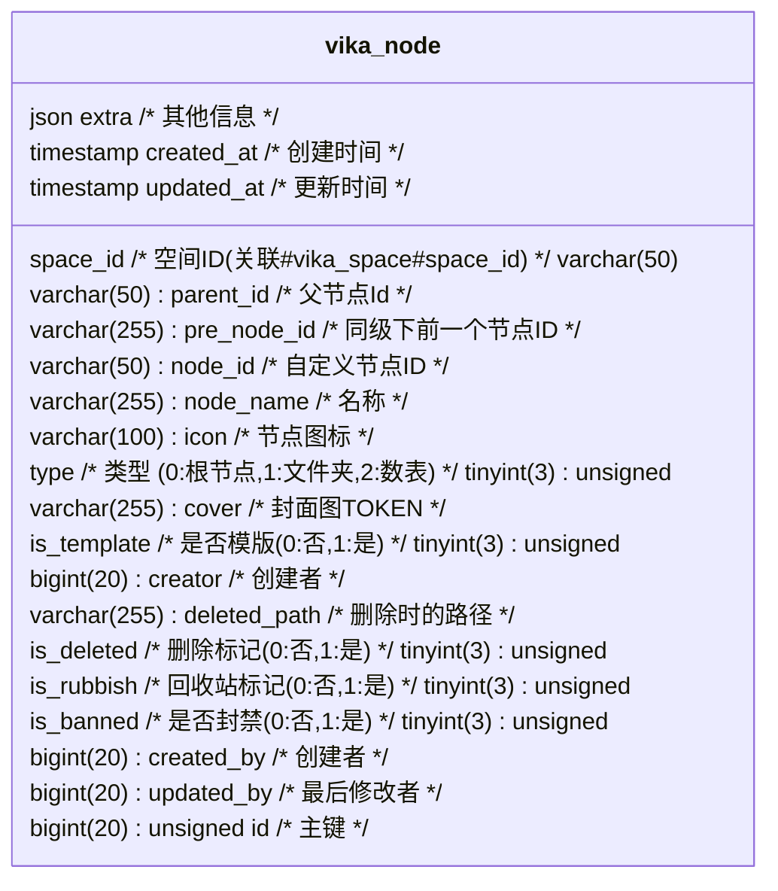
```mermaid
classDiagram
direction BT
class vika_node {
   space_id  /* 空间ID(关联#vika_space#space_id) */ varchar(50)
   varchar(50) parent_id  /* 父节点Id */
   varchar(255) pre_node_id  /* 同级下前一个节点ID */
   varchar(50) node_id  /* 自定义节点ID */
   varchar(255) node_name  /* 名称 */
   varchar(100) icon  /* 节点图标 */
   type  /* 类型 (0:根节点,1:文件夹,2:数表) */ tinyint(3) unsigned
   varchar(255) cover  /* 封面图TOKEN */
   is_template  /* 是否模版(0:否,1:是) */ tinyint(3) unsigned
   json extra  /* 其他信息 */
   bigint(20) creator  /* 创建者 */
   varchar(255) deleted_path  /* 删除时的路径 */
   is_deleted  /* 删除标记(0:否,1:是) */ tinyint(3) unsigned
   is_rubbish  /* 回收站标记(0:否,1:是) */ tinyint(3) unsigned
   is_banned  /* 是否封禁(0:否,1:是) */ tinyint(3) unsigned
   bigint(20) created_by  /* 创建者 */
   bigint(20) updated_by  /* 最后修改者 */
   timestamp created_at  /* 创建时间 */
   timestamp updated_at  /* 更新时间 */
   bigint(20) unsigned id  /* 主键 */
}
```

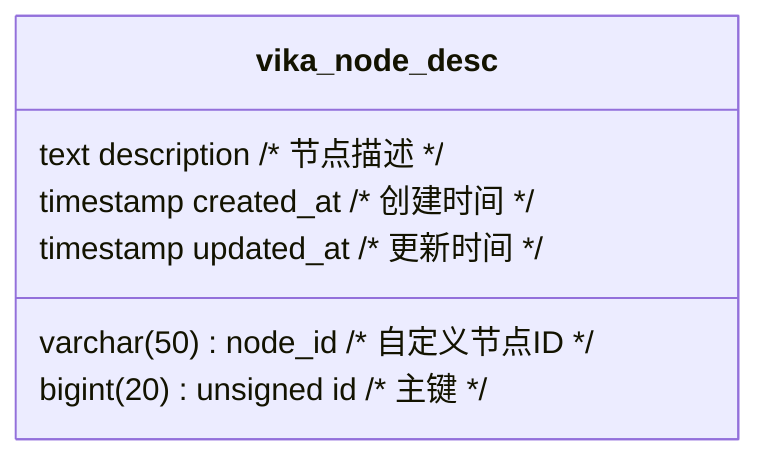
```mermaid
classDiagram
direction BT
class vika_node_desc {
   varchar(50) node_id  /* 自定义节点ID */
   text description  /* 节点描述 */
   timestamp created_at  /* 创建时间 */
   timestamp updated_at  /* 更新时间 */
   bigint(20) unsigned id  /* 主键 */
}
```

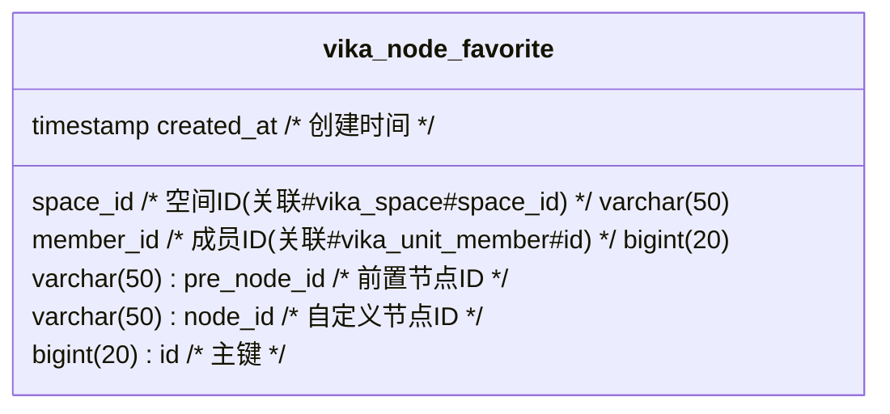
```mermaid
classDiagram
direction BT
class vika_node_favorite {
   space_id  /* 空间ID(关联#vika_space#space_id) */ varchar(50)
   member_id  /* 成员ID(关联#vika_unit_member#id) */ bigint(20)
   varchar(50) pre_node_id  /* 前置节点ID */
   varchar(50) node_id  /* 自定义节点ID */
   timestamp created_at  /* 创建时间 */
   bigint(20) id  /* 主键 */
}
```

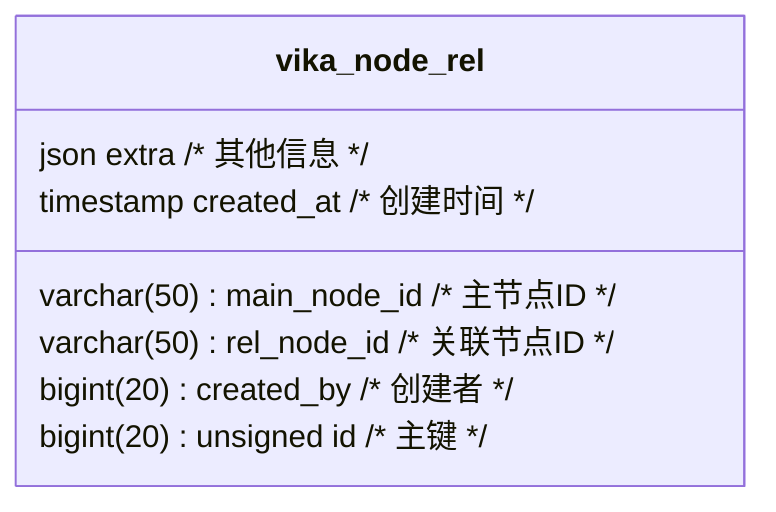
```mermaid
classDiagram
direction BT
class vika_node_rel {
    varchar(50) main_node_id  /* 主节点ID */
    varchar(50) rel_node_id  /* 关联节点ID */
    json extra  /* 其他信息 */
    bigint(20) created_by  /* 创建者 */
    timestamp created_at  /* 创建时间 */
    bigint(20) unsigned id  /* 主键 */
}
```

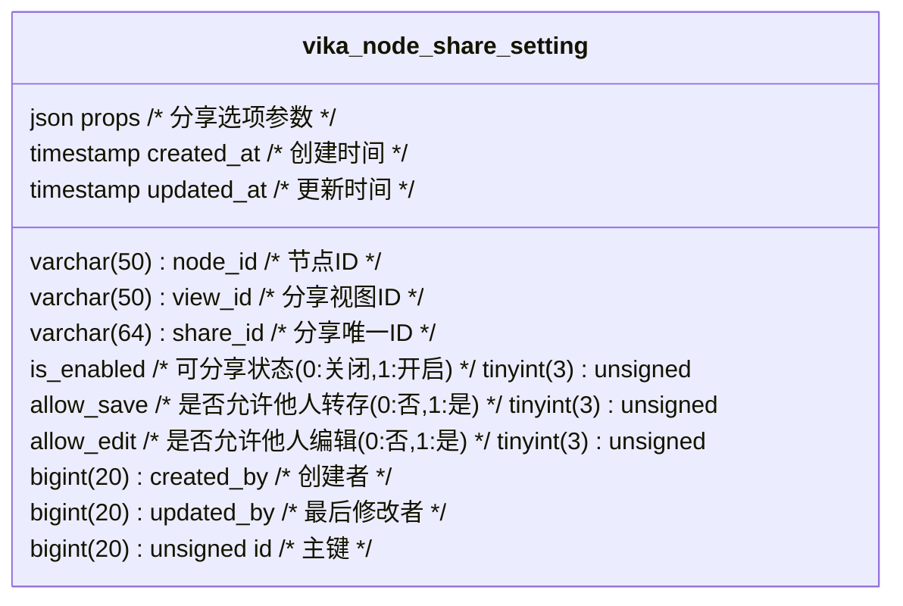
```mermaid
classDiagram
direction BT
class vika_node_share_setting {
   varchar(50) node_id  /* 节点ID */
   varchar(50) view_id  /* 分享视图ID */
   varchar(64) share_id  /* 分享唯一ID */
   is_enabled  /* 可分享状态(0:关闭,1:开启) */ tinyint(3) unsigned
   allow_save  /* 是否允许他人转存(0:否,1:是) */ tinyint(3) unsigned
   allow_edit  /* 是否允许他人编辑(0:否,1:是) */ tinyint(3) unsigned
   json props  /* 分享选项参数 */
   bigint(20) created_by  /* 创建者 */
   bigint(20) updated_by  /* 最后修改者 */
   timestamp created_at  /* 创建时间 */
   timestamp updated_at  /* 更新时间 */
   bigint(20) unsigned id  /* 主键 */
}
```

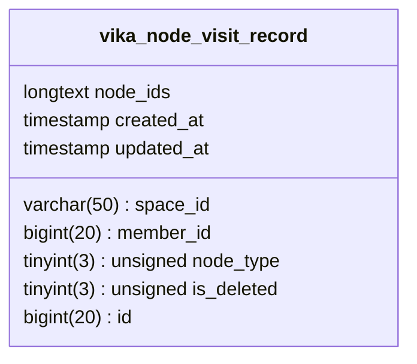
```mermaid
classDiagram
direction BT
class vika_node_visit_record {
   varchar(50) space_id
   bigint(20) member_id
   tinyint(3) unsigned node_type
   longtext node_ids
   tinyint(3) unsigned is_deleted
   timestamp created_at
   timestamp updated_at
   bigint(20) id
}
```

## organization domain

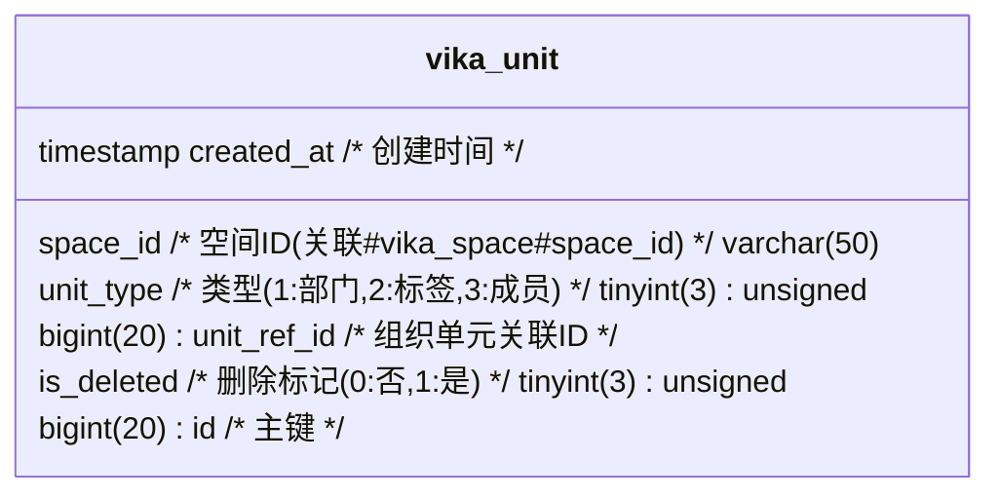
```mermaid
classDiagram
direction BT
class vika_unit {
   space_id  /* 空间ID(关联#vika_space#space_id) */ varchar(50)
   unit_type  /* 类型(1:部门,2:标签,3:成员) */ tinyint(3) unsigned
   bigint(20) unit_ref_id  /* 组织单元关联ID */
   is_deleted  /* 删除标记(0:否,1:是) */ tinyint(3) unsigned
   timestamp created_at  /* 创建时间 */
   bigint(20) id  /* 主键 */
}
```

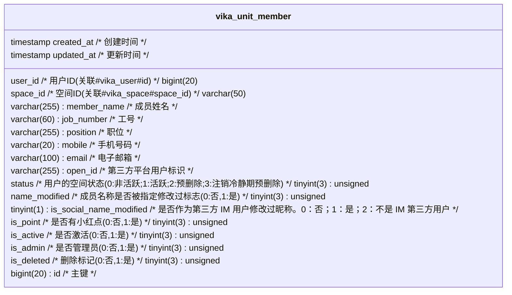
```mermaid
classDiagram
direction BT
class vika_unit_member {
   user_id  /* 用户ID(关联#vika_user#id) */ bigint(20)
   space_id  /* 空间ID(关联#vika_space#space_id) */ varchar(50)
   varchar(255) member_name  /* 成员姓名 */
   varchar(60) job_number  /* 工号 */
   varchar(255) position  /* 职位 */
   varchar(20) mobile  /* 手机号码 */
   varchar(100) email  /* 电子邮箱 */
   varchar(255) open_id  /* 第三方平台用户标识 */
   status  /* 用户的空间状态(0:非活跃;1:活跃;2:预删除;3:注销冷静期预删除) */ tinyint(3) unsigned
   name_modified  /* 成员名称是否被指定修改过标志(0:否,1:是) */ tinyint(3) unsigned
   tinyint(1) is_social_name_modified  /* 是否作为第三方 IM 用户修改过昵称。0：否；1：是；2：不是 IM 第三方用户 */
   is_point  /* 是否有小红点(0:否,1:是) */ tinyint(3) unsigned
   is_active  /* 是否激活(0:否,1:是) */ tinyint(3) unsigned
   is_admin  /* 是否管理员(0:否,1:是) */ tinyint(3) unsigned
   is_deleted  /* 删除标记(0:否,1:是) */ tinyint(3) unsigned
   timestamp created_at  /* 创建时间 */
   timestamp updated_at  /* 更新时间 */
   bigint(20) id  /* 主键 */
}
```

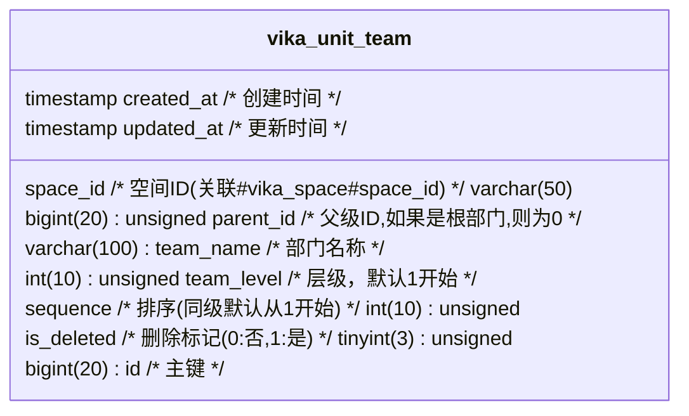
```mermaid
classDiagram
direction BT
class vika_unit_team {
   space_id  /* 空间ID(关联#vika_space#space_id) */ varchar(50)
   bigint(20) unsigned parent_id  /* 父级ID,如果是根部门,则为0 */
   varchar(100) team_name  /* 部门名称 */
   int(10) unsigned team_level  /* 层级，默认1开始 */
   sequence  /* 排序(同级默认从1开始) */ int(10) unsigned
   is_deleted  /* 删除标记(0:否,1:是) */ tinyint(3) unsigned
   timestamp created_at  /* 创建时间 */
   timestamp updated_at  /* 更新时间 */
   bigint(20) id  /* 主键 */
}
```

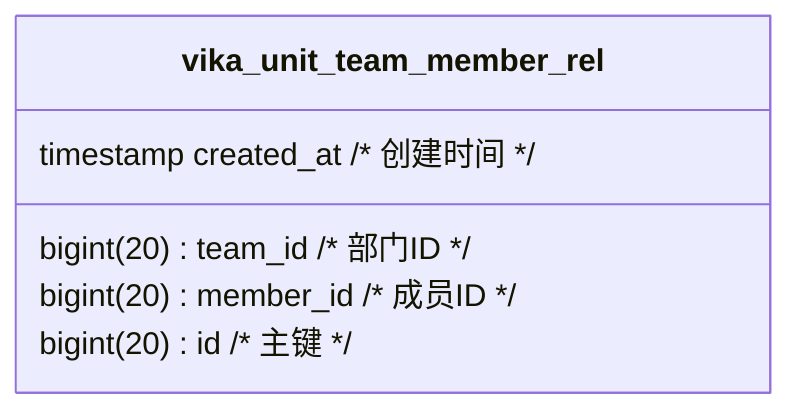
```mermaid
classDiagram
direction BT
class vika_unit_team_member_rel {
   bigint(20) team_id  /* 部门ID */
   bigint(20) member_id  /* 成员ID */
   timestamp created_at  /* 创建时间 */
   bigint(20) id  /* 主键 */
}
```

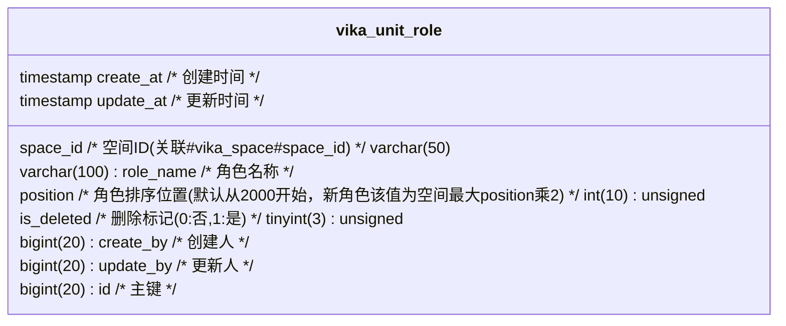
```mermaid
classDiagram
direction BT
class vika_unit_role {
    space_id  /* 空间ID(关联#vika_space#space_id) */ varchar(50)
    varchar(100) role_name  /* 角色名称 */
    position  /* 角色排序位置(默认从2000开始，新角色该值为空间最大position乘2) */ int(10) unsigned
    is_deleted  /* 删除标记(0:否,1:是) */ tinyint(3) unsigned
    bigint(20) create_by  /* 创建人 */
    bigint(20) update_by  /* 更新人 */
    timestamp create_at  /* 创建时间 */
    timestamp update_at  /* 更新时间 */
    bigint(20) id  /* 主键 */
}
```

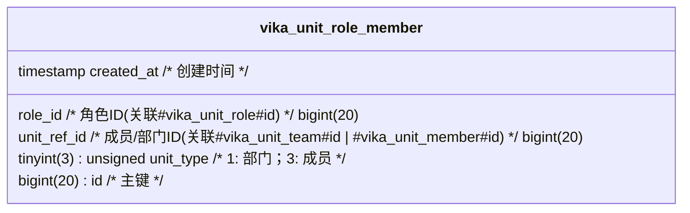
```mermaid
classDiagram
direction BT
class vika_unit_role_member {
   role_id  /* 角色ID(关联#vika_unit_role#id) */ bigint(20)
   unit_ref_id  /* 成员/部门ID(关联#vika_unit_team#id | #vika_unit_member#id) */ bigint(20)
   tinyint(3) unsigned unit_type  /* 1: 部门；3: 成员 */
   timestamp created_at  /* 创建时间 */
   bigint(20) id  /* 主键 */
}
```

## control domain

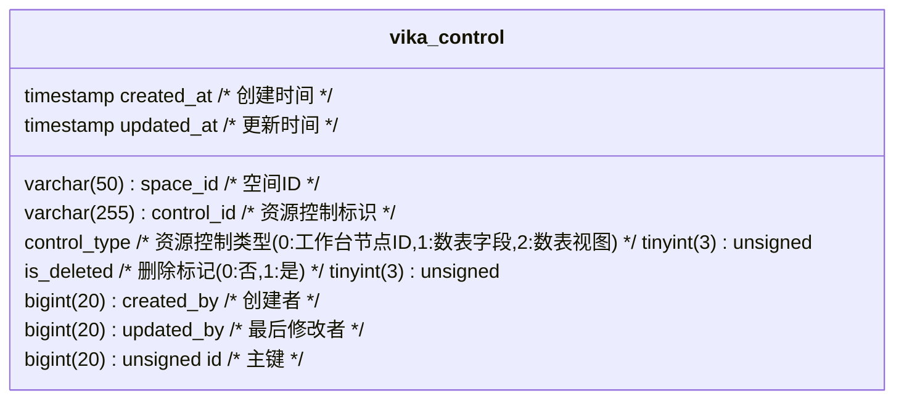
```mermaid
classDiagram
direction BT
class vika_control {
   varchar(50) space_id  /* 空间ID */
   varchar(255) control_id  /* 资源控制标识 */
   control_type  /* 资源控制类型(0:工作台节点ID,1:数表字段,2:数表视图) */ tinyint(3) unsigned
   is_deleted  /* 删除标记(0:否,1:是) */ tinyint(3) unsigned
   bigint(20) created_by  /* 创建者 */
   bigint(20) updated_by  /* 最后修改者 */
   timestamp created_at  /* 创建时间 */
   timestamp updated_at  /* 更新时间 */
   bigint(20) unsigned id  /* 主键 */
}
```

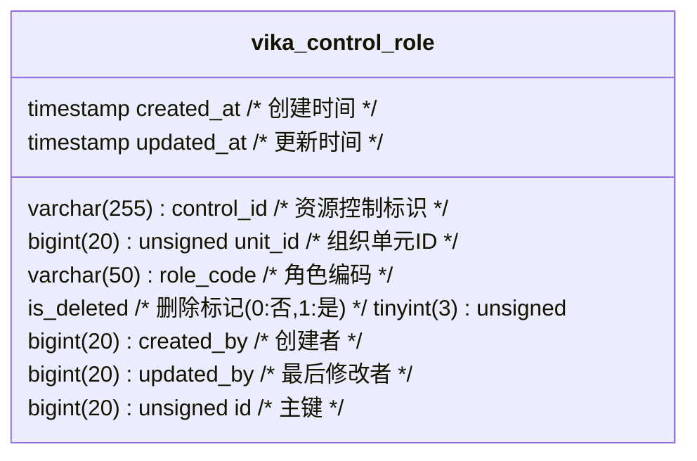
```mermaid
classDiagram
direction BT
class vika_control_role {
   varchar(255) control_id  /* 资源控制标识 */
   bigint(20) unsigned unit_id  /* 组织单元ID */
   varchar(50) role_code  /* 角色编码 */
   is_deleted  /* 删除标记(0:否,1:是) */ tinyint(3) unsigned
   bigint(20) created_by  /* 创建者 */
   bigint(20) updated_by  /* 最后修改者 */
   timestamp created_at  /* 创建时间 */
   timestamp updated_at  /* 更新时间 */
   bigint(20) unsigned id  /* 主键 */
}
```

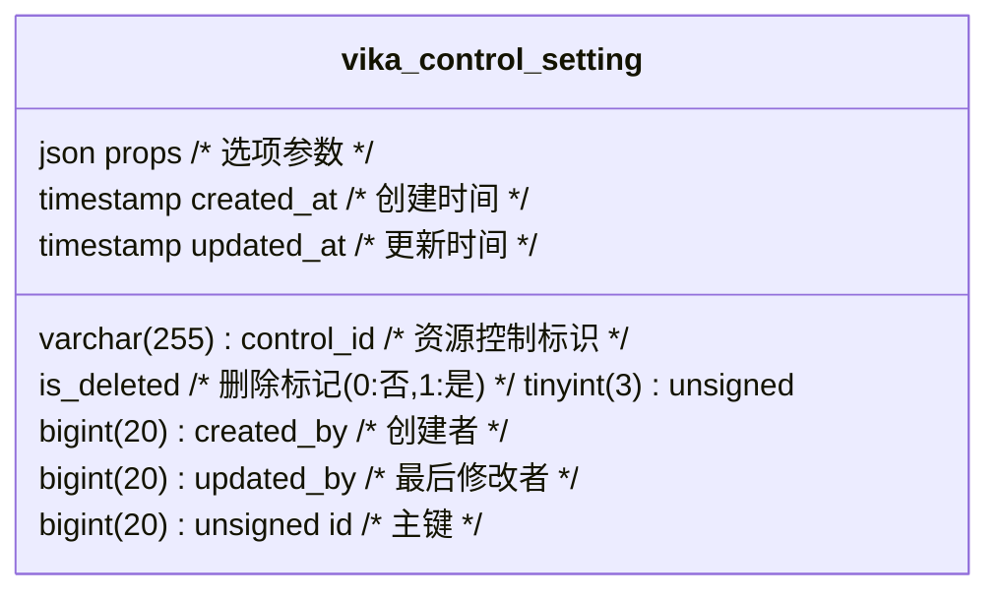
```mermaid
classDiagram
direction BT
class vika_control_setting {
   varchar(255) control_id  /* 资源控制标识 */
   json props  /* 选项参数 */
   is_deleted  /* 删除标记(0:否,1:是) */ tinyint(3) unsigned
   bigint(20) created_by  /* 创建者 */
   bigint(20) updated_by  /* 最后修改者 */
   timestamp created_at  /* 创建时间 */
   timestamp updated_at  /* 更新时间 */
   bigint(20) unsigned id  /* 主键 */
}
```

## asset domain

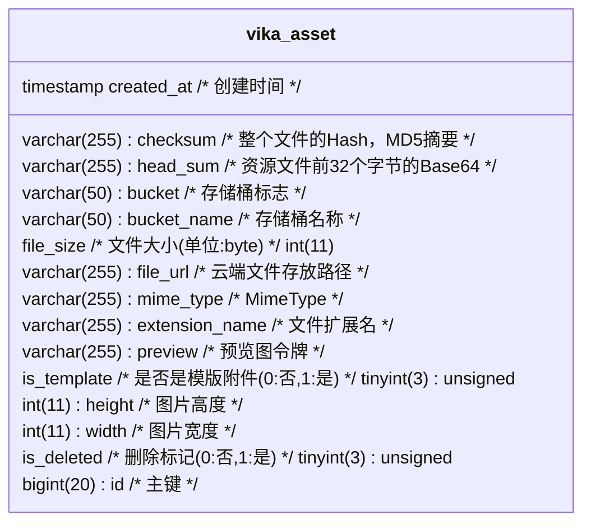
```mermaid
classDiagram
direction BT
class vika_asset {
   varchar(255) checksum  /* 整个文件的Hash，MD5摘要 */
   varchar(255) head_sum  /* 资源文件前32个字节的Base64 */
   varchar(50) bucket  /* 存储桶标志 */
   varchar(50) bucket_name  /* 存储桶名称 */
   file_size  /* 文件大小(单位:byte) */ int(11)
   varchar(255) file_url  /* 云端文件存放路径 */
   varchar(255) mime_type  /* MimeType */
   varchar(255) extension_name  /* 文件扩展名 */
   varchar(255) preview  /* 预览图令牌 */
   is_template  /* 是否是模版附件(0:否,1:是) */ tinyint(3) unsigned
   int(11) height  /* 图片高度 */
   int(11) width  /* 图片宽度 */
   is_deleted  /* 删除标记(0:否,1:是) */ tinyint(3) unsigned
   timestamp created_at  /* 创建时间 */
   bigint(20) id  /* 主键 */
}
```

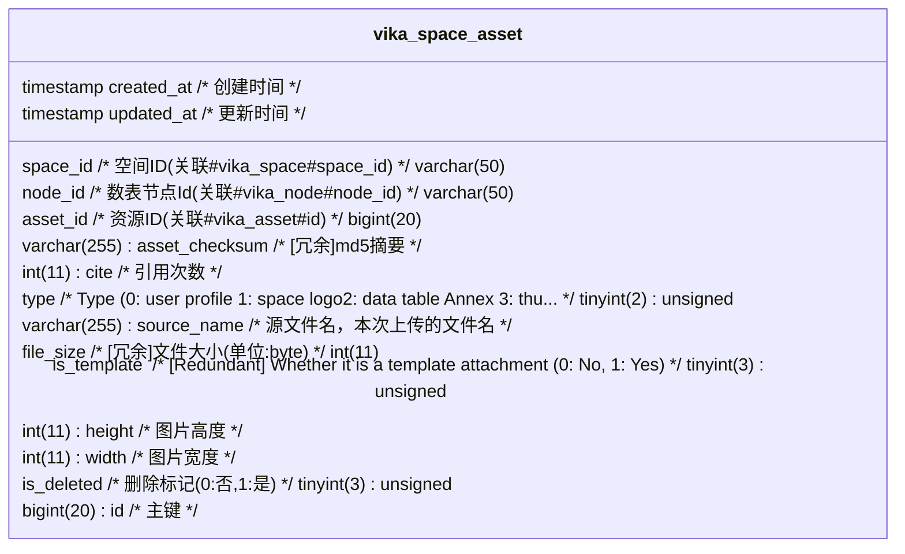
```mermaid
classDiagram
direction BT
class vika_space_asset {
   space_id  /* 空间ID(关联#vika_space#space_id) */ varchar(50)
   node_id  /* 数表节点Id(关联#vika_node#node_id) */ varchar(50)
   asset_id  /* 资源ID(关联#vika_asset#id) */ bigint(20)
   varchar(255) asset_checksum  /* [冗余]md5摘要 */
   int(11) cite  /* 引用次数 */
   type  /* Type (0: user profile 1: space logo2: data table Annex 3: thu... */ tinyint(2) unsigned
   varchar(255) source_name  /* 源文件名，本次上传的文件名 */
   file_size  /* [冗余]文件大小(单位:byte) */ int(11)
   is_template  /* [Redundant] Whether it is a template attachment (0: No, 1: Yes) */ tinyint(3) unsigned
   int(11) height  /* 图片高度 */
   int(11) width  /* 图片宽度 */
   is_deleted  /* 删除标记(0:否,1:是) */ tinyint(3) unsigned
   timestamp created_at  /* 创建时间 */
   timestamp updated_at  /* 更新时间 */
   bigint(20) id  /* 主键 */
}
```

## player domain

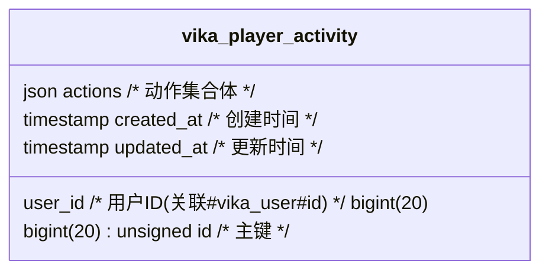
```mermaid
classDiagram
direction BT
class vika_player_activity {
   user_id  /* 用户ID(关联#vika_user#id) */ bigint(20)
   json actions  /* 动作集合体 */
   timestamp created_at  /* 创建时间 */
   timestamp updated_at  /* 更新时间 */
   bigint(20) unsigned id  /* 主键 */
}
```

```mermaid
classDiagram
direction BT
class vika_player_notification {
   varchar(32) space_id  /* 空间ID */
   bigint(20) from_user  /* 发送用户，如果为0 这是系统用户 */
   bigint(20) to_user  /* 接收用户 */
   node_id  /* 节点ID(冗余字段) */ varchar(32)
   varchar(50) template_id  /* 通知模版ID */
   varchar(10) notify_type  /* 通知类型 */
   json notify_body  /* 通知消息体 */
   is_read  /* 是否已读(0:否,1:是) */ tinyint(3) unsigned
   is_deleted  /* 删除标记(0:否,1:是) */ tinyint(3) unsigned
   timestamp created_at  /* 创建时间 */
   timestamp updated_at  /* 更新时间 */
   bigint(20) unsigned id  /* 主键 */
}
```

## widget domain

```mermaid
classDiagram
direction BT
class vika_widget {
   varchar(50) space_id  /* 空间ID */
   varchar(50) node_id  /* 节点ID */
   package_id  /* 组件包ID(关联#vika_widget_package#package_id) */ varchar(50)
   varchar(50) widget_id  /* 自定组件ID */
   varchar(255) name  /* 名称 */
   json storage  /* 存储配置 */
   bigint(20) unsigned revision  /* 版本号 */
   is_deleted  /* 删除标记(0:否,1:是) */ tinyint(3) unsigned
   bigint(20) created_by  /* 创建者 */
   bigint(20) updated_by  /* 最后修改者 */
   timestamp created_at  /* 创建时间 */
   timestamp updated_at  /* 更新时间 */
   bigint(20) unsigned id  /* 主键 */
}
```

```mermaid
classDiagram
direction BT
class vika_widget_package {
   varchar(50) package_id  /* 组件包ID */
   json i18n_name  /* 国际化组件名称 */
   json i18n_description  /* 国际化组件描述 */
   varchar(255) icon  /* 图标 */
   varchar(255) cover  /* 封面图TOKEN */
   status  /* 状态(0:开发中,1:已封禁,2:待发布,3:已发布,4:已下架-全局暂不开放)目前保留3，4 */ tinyint(3) unsigned
   int(10) unsigned installed_num  /* 安装次数 */
   varchar(255) name  /* 名称 - 【废弃删除】 */
   varchar(255) name_en  /* 英文名称 - 【废弃删除】 */
   varchar(30) version  /* 版本 - 【废弃删除】 */
   text description  /* 描述 - 【废弃删除】 */
   varchar(50) author_name  /* 作者名 */
   varchar(100) author_email  /* 作者email */
   varchar(255) author_icon  /* 作者图标TOKEN */
   varchar(255) author_link  /* 作者网站地址 */
   package_type  /* 组件包类型(0:第三方,1:官方) */ tinyint(4)
   tinyint(4) release_type  /* 0：发布到空间站中的组件商店，1：发布到全局应用商店（只有 package_type 为 0 才允许） */
   json widget_body  /* 组件包扩展信息 */
   sandbox  /* 是否沙箱运行(0:否,1:是) */ tinyint(1)
   bigint(20) release_id  /* release版本id，当前激活的版本，可为空，空的时候，在组建商店只展示给创建者 */
   is_template  /* 是否模版(0:否,1:是) */ tinyint(3) unsigned
   is_enabled  /* 是否启用，只针对全局小组件(0:未启用,1:启用) */ tinyint(3) unsigned
   is_deleted  /* 删除标记(0:否,1:是) */ tinyint(3) unsigned
   owner  /* 拥有者Id(关联#vika_user#id) */ bigint(20)
   bigint(20) created_by  /* 创建者 */
   bigint(20) updated_by  /* 最后修改者 */
   timestamp created_at  /* 创建时间 */
   timestamp updated_at  /* 更新时间 */
   varchar(255) install_env_code  /* 安装环境编码 */
   varchar(255) runtime_env_code  /* 运行环境编码 */
   bigint(20) unsigned id  /* 主键 */
}
```

```mermaid
classDiagram
direction BT
class vika_widget_package_auth_space {
   varchar(50) package_id  /* 组件包ID */
   space_id  /* 空间ID(关联#vika_space#space_id) */ varchar(50)
   type  /* 组件包授权类型(0:绑定空间-不可删除，同一组件包可由该空间的”开发权限“管理员共同管理；全局组件也会有，用于升级等需要;... */ tinyint(3) unsigned
   int(10) unsigned widget_sort  /* 排序号，空间站小组件从10000开始 */
   is_deleted  /* 删除标记(0:否,1:是) */ tinyint(3) unsigned
   bigint(20) created_by  /* 创建者 */
   bigint(20) updated_by  /* 最后修改者 */
   timestamp created_at  /* 创建时间 */
   timestamp updated_at  /* 更新时间 */
   bigint(20) unsigned id  /* 主键 */
}
```

```mermaid
classDiagram
direction BT
class vika_widget_package_release {
    release_sha  /* 版本摘要唯一标识(id+package_id+version生成) */ varchar(50)
    varchar(16) version  /* 版本号,package_id下唯一 */
    varchar(50) package_id  /* 组件包ID */
    release_user_id  /* 用户ID(关联#vika_user#id) */ bigint(20)
    varchar(255) release_code_bundle  /* 代码地址 */
    varchar(255) source_code_bundle  /* 源代码地址 */
    varchar(64) secret_key  /* 源码加密密钥 */
    status  /* 状态(0:待审核,1:审核通过,2:已拒绝) */ tinyint(4)
    varchar(255) release_note  /* 发布版本说明 */
    is_deleted  /* 删除标记(0:否,1:是) */ tinyint(3) unsigned
    bigint(20) created_by  /* 创建者 */
    bigint(20) updated_by  /* 最后修改者 */
    timestamp created_at  /* 创建时间 */
    timestamp updated_at  /* 更新时间 */
    varchar(255) install_env_code  /* 安装环境编码 */
    varchar(255) runtime_env_code  /* 运行环境编码 */
    bigint(20) unsigned id  /* 主键 */
}
```
