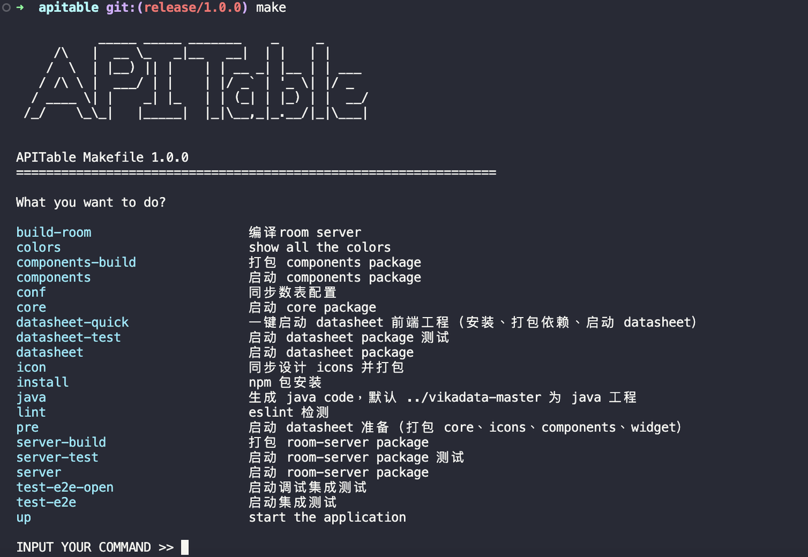

# Makefile

`make`命令，是vikadata工程和apitable工程的编译工具聚合。

vikadata目录和apitable各有一个make命令的makefile，他们互相独立可执行。
vikadata的makefile通常依赖于apitable。

## 命令解释

| 命令 | 用途                                                | vikadata | apitable |
|------|-----------------------------------------------------|----------|----------|
| up   | 直接取容器并docker-compose运行，需要先pull或build。 | ✅        | ✅        |
| up-docker | 同上，既可用于日常开发，也能用于私有化部署。vikadata版，要考虑备份。 | ✅ | ✅ | 
| up-k3s | vagrant up，K3S运行。既可用于日常开发，也能用于私有化部署。要考虑备份。 | ✅ | ❌ |
| configure | Select menu选择配置环境，比如，模拟integration环境，连integration的数据库 | ✅ | ❌ |
| devenv | 云原生Mount Volume本地代码运行 | ✅ | ✅ |
| devenv-xxx | 云原生Mount Volume本地代码运行某个服务 | ✅ | ✅ |
| devenv-down | 删掉所有云原生运行的本地代码服务 | ✅ | ✅ |
| setup | 帮你本地电脑安装各种必备软件，比如homebrew、docker desktop、kubectl等等 | ✅ | ❌ |
| install | 云原生mount本地代码进行install所有依赖 | ✅ | ✅ |
| install-xxxx | install某个服务 | ✅ | ✅ |
| build | 编译所有容器 | ✅ | ✅ |
| build-xxxx | 编译某个容器服务 | ✅ | ✅ |
| buildpush | 编译并推送到仓库 | ✅ | ✅ |
| buildpush-xxxx | 编译并推送某个容器服务 | ✅ | ✅ | 
| pull | 拉取所有服务的容器到本地环境 | ✅ | ✅ |
| test | 测试所有服务 | ✅ | ✅ |
| test-xxx | 测试某个服务 | ✅ | ✅ |
| patch | Bumpversion patch | ✅ | ✅ |
| minor | Bumpversion minor | ✅ | ✅ |
| major | Bumpversion major，通常不写进去 | ❌ | ❌ |
| _xxxxx | 下划线开始，通常用于被其它make target引用 | ✅ | ✅ |
| OTHERS | 嗯，其它自由发挥 | ✅ | ✅ |

> 以上命令仅供大体框架参考，命令最终以`make`实际执行为准，日常过程文档不及更新

## 注意事项

- Github Action中，尽可能地调用Makefile命令来完成，让本地与CI执行一致性，且Github Action Yaml非常简洁
- vikadata工程的Makefile，是依赖于apitable的Makefile。
- target命名用“-”(dash)，而不是“_”(underscore)，`make help`才能识别到
